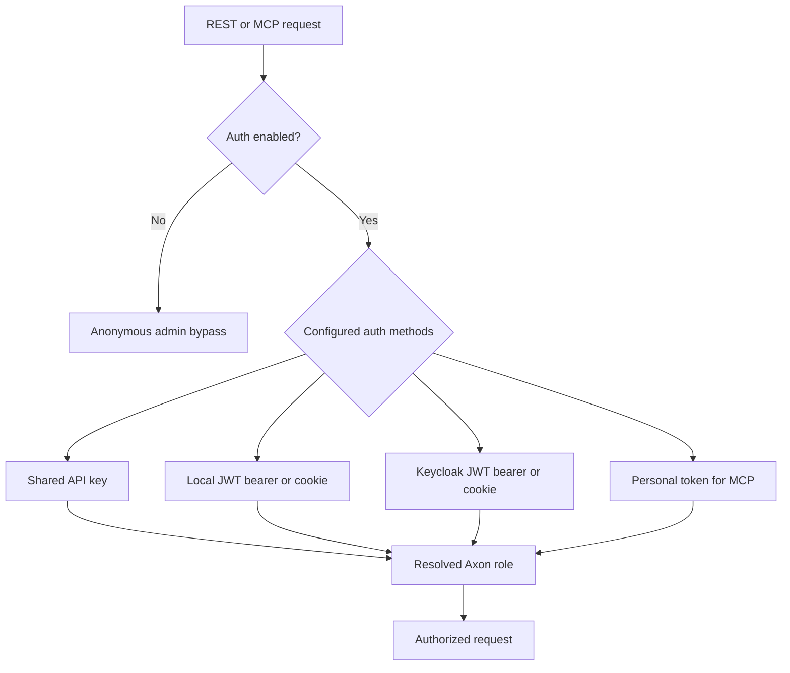
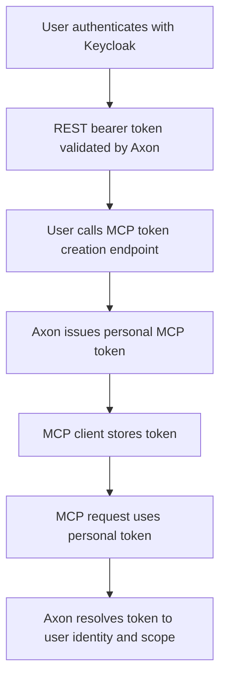

# Authentication And MCP Token Plan

## Scope

Define the current authentication model and the approved next direction:

1. configurable accepted authentication forms for REST and MCP
2. Keycloak-backed authentication for the REST API
3. personalized Axon-issued tokens for MCP access

This document is the canonical status and direction reference for the current auth model and the approved follow-up work.

## Current State

`✅` implemented, `🚧` partial, `🛑` not implemented.

| Area | Status | Notes |
| --- | --- | --- |
| API key auth for REST/API routes | `✅` | `X-API-Key` supported |
| Cookie/JWT auth for browser sessions | `✅` | Local JWT issuance/validation path exists |
| Configurable accepted auth forms | `✅` | REST and MCP each accept a configured method list |
| Full REST auth bypass via config | `✅` | `AUTH_ENABLED=false` disables auth globally |
| MCP auth switch | `✅` | `MCP_AUTH_ENABLED=false` disables MCP auth |
| Shared admin API key model | `✅` | Present today |
| External OIDC/Keycloak token validation | `✅` | Keycloak JWT validation is supported when enabled/configured |
| Keycloak browser login/session flow | `✅` | Auth-code redirect/callback and browser cookie session handoff are implemented |
| User-scoped personal access tokens for MCP | `✅` | REST endpoints can create/list/revoke them |
| Token revocation/expiry management for MCP personal tokens | `✅` | Expiry and revocation are enforced |

## Current Auth Model

## Current Direction

### REST API

Use configurable auth acceptance with Keycloak added as an additional supported form for REST/API authentication.

Recommended behavior:

1. Operators choose one or more accepted auth forms for REST.
2. REST can continue accepting existing local API keys and local JWTs.
3. REST can additionally accept Keycloak bearer tokens.
4. Browser users can also authenticate through a Keycloak auth-code redirect/callback flow.
5. Axon validates issuer, audience, expiry, and signature for Keycloak tokens.
6. Axon maps claims/groups into Axon roles.

### MCP

Use configurable accepted auth forms for MCP, with Axon-issued personal access tokens as the preferred future non-interactive path.

Recommended behavior:

1. User authenticates to REST through Keycloak.
2. User calls a REST endpoint to create a personal MCP token.
3. Axon stores only a hash of that token.
4. MCP clients use the token for non-interactive access.

In the near term, MCP should also support configurable acceptance of the existing shared API key and local JWT flows where needed.

## Why This Split Is Recommended

| Concern | Recommendation | Reason |
| --- | --- | --- |
| Browser / REST login | Keycloak + configurable fallback forms | Proper SSO without forcing a flag-day migration |
| MCP client auth | Personal Axon token | Simpler for non-interactive clients than full OAuth flows |
| Shared admin key | Keep as configurable fallback | Needed during migration and for service clients |
| Role mapping | Derive from Keycloak claims/groups when Keycloak is used | Centralized authorization source |

## Target Model

## Required Capabilities

`🧭` next action, `🔥` risk.

| Capability | Status | Notes |
| --- | --- | --- |
| Configurable accepted auth forms per surface | `✅` | REST and MCP each accept one or more configured methods |
| Keycloak bearer token validation | `✅` | Issuer/audience/JWKS validation is implemented |
| Keycloak browser auth-code login/callback | `✅` | Browser session flow is implemented |
| User identity mapping in Axon | `🧭` | Rich local user/account management is deferred |
| Personal access token persistence | `✅` | Token material is stored hashed |
| Token create/list/revoke endpoints | `✅` | Available through REST auth routes |
| MCP auth path for personal tokens | `✅` | Personal tokens are an accepted auth method |
| Audit trail for external identities and token usage | `🧭` | Explicitly deferred to later work |

## Configuration Direction

Recommended future settings:

| Setting | Purpose |
| --- | --- |
| `REST_AUTH_METHODS` | Accepted REST auth methods such as `api_key`, `local_jwt`, `keycloak_jwt` |
| `MCP_AUTH_METHODS` | Accepted MCP auth methods such as `api_key`, `local_jwt`, `keycloak_jwt`, and later personal MCP tokens |
| `OIDC_ISSUER_URL` | Keycloak realm issuer |
| `OIDC_AUDIENCE` | Expected client/app audience |
| `OIDC_JWKS_URL` | Optional explicit JWKS endpoint |
| `OIDC_ROLE_CLAIM` | Claim used for role/group mapping |
| `KEYCLOAK_CLIENT_ID` | Browser login client for auth-code flow |
| `KEYCLOAK_CLIENT_SECRET` | Optional confidential-client secret for code exchange |
| `KEYCLOAK_SCOPES` | Browser login scopes such as `openid,profile,email` |
| `KEYCLOAK_REDIRECT_URI` | Optional external callback override when request URLs are not public URLs |
| `MCP_TOKEN_DEFAULT_TTL_DAYS` | Default lifetime for personal MCP tokens |

## Execution Order

1. Document the target auth model.
2. Add configurable accepted auth forms plus Keycloak REST validation.
3. Keep current API key and local JWT forms available behind config.
4. Add personal MCP token model and REST endpoints.
5. Extend MCP auth path to accept personal tokens.

## Explicitly Deferred

This slice intentionally does not implement:

1. persistent local user/account records beyond claim-derived session identity
2. audit history for Keycloak logins or MCP token usage
3. personal-space or local-change tracking tied to the authenticated user model
