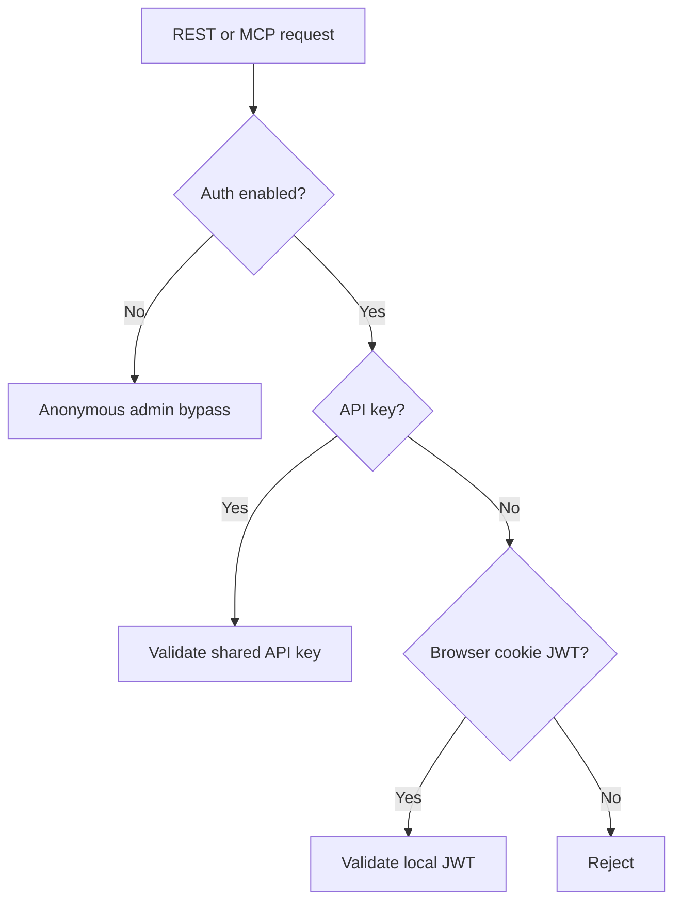
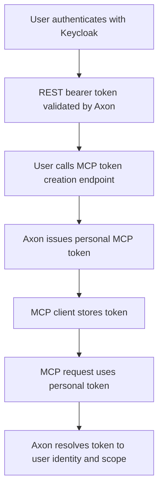

# Authentication And MCP Token Plan

## Scope

Define the current authentication model and the approved next direction:

1. Keycloak-backed authentication for the REST API
2. personalized Axon-issued tokens for MCP access

This document is a design/plan reference, not a statement that the target model is already shipped.

## Current State

`✅` implemented, `🚧` partial, `🛑` not implemented.

| Area | Status | Notes |
| --- | --- | --- |
| API key auth for REST/API routes | `✅` | `X-API-Key` supported |
| Cookie/JWT auth for browser sessions | `✅` | Local JWT issuance/validation path exists |
| Full REST auth bypass via config | `✅` | `AUTH_ENABLED=false` disables auth globally |
| MCP auth switch | `✅` | `MCP_AUTH_ENABLED=false` disables MCP auth |
| Shared admin API key model | `✅` | Present today |
| External OIDC/Keycloak token validation | `🛑` | Not implemented |
| User-scoped personal access tokens for MCP | `🛑` | Not implemented |
| Token revocation/expiry management for MCP personal tokens | `🛑` | Not implemented |

## Current Auth Model

## Approved Direction

### REST API

Use Keycloak as the identity provider for REST/API authentication.

Recommended behavior:

1. REST clients present Keycloak bearer tokens.
2. Axon validates issuer, audience, expiry, and signature.
3. Axon maps claims/groups into Axon roles.
4. Local JWT issuance becomes optional/dev-only rather than the primary production model.

### MCP

Use Axon-issued personal access tokens generated by authenticated users through REST.

Recommended behavior:

1. User authenticates to REST through Keycloak.
2. User calls a REST endpoint to create a personal MCP token.
3. Axon stores only a hash of that token.
4. MCP clients use the token for non-interactive access.

## Why This Split Is Recommended

| Concern | Recommendation | Reason |
| --- | --- | --- |
| Browser / REST login | Keycloak | Proper SSO and centralized identity |
| MCP client auth | Personal Axon token | Simpler for non-interactive clients than full OAuth flows |
| Shared admin key | Keep only as optional fallback | Avoid one shared credential for all users |
| Role mapping | Derive from Keycloak claims/groups | Centralized authorization source |

## Target Model

## Required Capabilities

`🧭` next action, `🔥` risk.

| Capability | Status | Notes |
| --- | --- | --- |
| Auth provider abstraction (`local`, `keycloak`) | `🧭` | Needed to avoid hardcoding one auth backend |
| Keycloak bearer token validation | `🧭` | Issuer/audience/JWKS validation |
| User identity mapping in Axon | `🧭` | External identity to local role/scope mapping |
| Personal access token persistence | `🧭` | Store hashed token material only |
| Token create/list/revoke endpoints | `🧭` | Needed for MCP user workflows |
| MCP auth path for personal tokens | `🧭` | Extend MCP auth beyond shared admin key |

## Configuration Direction

Recommended future settings:

| Setting | Purpose |
| --- | --- |
| `AUTH_PROVIDER` | `local` or `keycloak` |
| `OIDC_ISSUER_URL` | Keycloak realm issuer |
| `OIDC_AUDIENCE` | Expected client/app audience |
| `OIDC_JWKS_URL` | Optional explicit JWKS endpoint |
| `OIDC_ROLE_CLAIM` | Claim used for role/group mapping |
| `MCP_TOKEN_DEFAULT_TTL_DAYS` | Default lifetime for personal MCP tokens |

## Execution Order

1. Document the target auth model.
2. Add auth-provider abstraction and Keycloak REST validation.
3. Add personal MCP token model and REST endpoints.
4. Extend MCP auth path to accept personal tokens.
5. Keep shared admin key support only as an explicit fallback/dev path.
