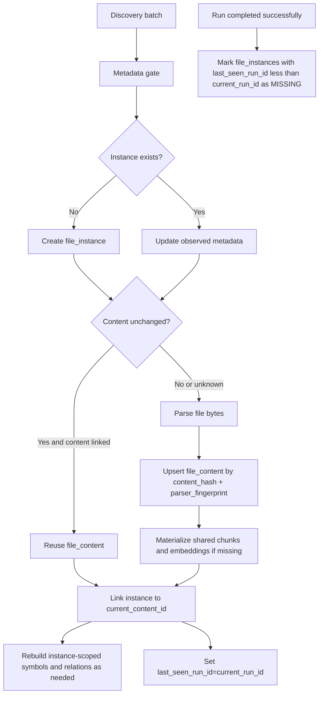

# File Instance / File Content Architecture Design

## Snapshot

- Date: 2026-03-18
- Status: `🚧` active implementation track with core lifecycle foundation landed
- Purpose: define the data-model split needed for content reuse, multi-variant indexing, and explicit deleted-file handling

## Objective

Separate:

1. **File instance identity**: where a file exists in a specific repository/source/path context.
2. **Canonical file content identity**: the reusable parsed content for a specific byte stream under a specific parser contract.

This design replaces the previous deferred proposal and is now the canonical reference for the current highest-priority indexing architecture increment.

## Why This Exists Now

The streaming indexing baseline is in place:

- discovery batches and metadata gate are active
- changed/new-only parse fanout is active
- changed-chunk-only embedding work is active
- unchanged rerun optimizations and observability are in place

The next correctness boundary is no longer queueing. It is data ownership:

| Problem | Current effect | Why the split fixes it |
| --- | --- | --- |
| `files` row mixes path identity with content identity | repeated parse/chunk/embed work for identical bytes | content becomes reusable across many instances |
| deleted/missing files have ambiguous lifecycle | repository counts and cleanup semantics drift | instance lifecycle becomes explicit |
| future local checkout + remote clone support needs shared content | same bytes are stored repeatedly | content artifacts can be keyed once and referenced many times |
| cross-branch/worktree support needs path context without duplicating artifacts | path-scoped rows own too much | instance rows carry source/path state; content rows carry reusable data |

## Current Model vs Target Model

| Area | Current | Target |
| --- | --- | --- |
| Source file identity | single `files` row | `file_instances` row |
| Content identity | `files.content_hash` only | first-class `file_contents` row |
| Chunks | owned by `file_id` | owned by `file_content_id` |
| Embeddings | owned by chunk row | still owned by chunk row, but chunks are content-scoped |
| Symbols | owned by `file_id` | phase 1 stays instance-scoped |
| Cross-file relations | owned by instance-scoped symbols | remain instance-scoped |
| Deleted file tracking | implicit/mixed | explicit instance lifecycle |

## Design Principles

`✅` required, `⚠️` recommended, `⛔` prohibited.

| Rule | Requirement |
| --- | --- |
| `✅` | Split reusable content artifacts from source-context instance metadata. |
| `✅` | Keep symbols and graph relations instance-scoped; do not design for future full symbol sharing. |
| `✅` | Land the smallest vertical slice first: chunks + embeddings reuse before symbol/relation dedup. |
| `✅` | Make deleted/missing state explicit in the schema instead of inferring it from missing paths. |
| `✅` | Prefer the simplest clean schema for the target model; database reset is acceptable for this WIP fork. |
| `⛔` | Do not attempt full cross-file relation sharing in the first implementation wave. |

## Conceptual Model

### File Instance

Represents a file in a repository/source/path context.

Owns:

- repository/source identity
- relative path
- latest observed size and mtime
- lifecycle state
- pointer to currently active content
- observation timestamps (`first_seen_at`, `last_seen_at`)

### File Content

Represents canonical bytes parsed under a specific parser contract.

Owns:

- `content_hash`
- language
- parser fingerprint/version
- parse-mode fingerprint when relevant
- reusable chunk rows
- reusable embedding rows through those chunks

### Instance-Scoped Derived Graph

Represents context-sensitive knowledge that should not be shared in v1.

Owns:

- symbols
- import/call/reference relations
- service mapping
- repository dependency associations where semantics depend on repository context

### Future Reusable Parse Patterns

This is a possible later optimization, not part of the initial model.

The likely reusable unit is **not** the final symbol row set. It is a lighter-weight
content-derived parse artifact or "symbol pattern" that may help rebuild instance-scoped
symbols faster by substituting path/context variables.

Examples of what such a pattern may eventually capture:

- symbol layout shape
- local nesting structure
- placeholderized package/module prefixes
- parser-derived offsets or reusable intermediate forms

This remains explicitly deferred until the content/instance split is implemented and
measured. Final symbol persistence remains instance-scoped.

## Shareability Rules

`✅` shareable, `🚧` maybe later, `🛑` keep instance-scoped.

| Artifact Type | Shareability | Scope in v1 | Notes |
| --- | --- | --- | --- |
| Raw file bytes hash | `✅` | content | primary dedup key |
| Normalized chunks | `✅` | content | safe first shared artifact |
| Embeddings | `✅` | content | reused via shared chunks |
| Parse metadata (`line_count`, parse duration, parser outputs cache) | `✅` | content | optional cache, useful but not required for first cut |
| Symbol rows | `🛑` | instance | path and repository context are fundamental; final symbol rows stay instance-scoped |
| Import/call/reference relations | `🛑` | instance | depend on repository-visible targets and graph state |
| Endpoint and service assignment | `🛑` | instance | repository/service context matters |
| Patternized parse intermediates | `🚧` | content | possible future shortcut for rebuilding instance-scoped symbols |
| Dependency rows | `🚧` | mixed | manifest parsing may be content-derived; repository dependency views remain instance-scoped |

## Proposed Schema Direction

The exact migration shape can vary, but compatibility constraints are intentionally light:

- this fork is still WIP
- the database can be reset during rollout
- no backward-compatible dual-write requirement is assumed unless implementation friction proves otherwise

The design target is:

### `file_instances`

| Column | Purpose |
| --- | --- |
| `id` | primary key |
| `repository_id` | owning repository/source |
| `path` | relative path within source |
| `language` | latest detected language |
| `size_bytes` | latest observed size |
| `last_modified` | latest observed mtime |
| `lifecycle_state` | `ACTIVE`, `MISSING`, or `DELETED` |
| `current_content_id` | nullable FK to `file_contents` |
| `last_seen_run_id` | latest successful discovery run that observed this file as present |
| `first_seen_at` | first observed in this source/path |
| `last_seen_at` | last confirmed present during discovery |
| `missing_since` | first time observed absent |
| `deleted_at` | terminal cleanup timestamp when finalized |
| `created_at` / `updated_at` | standard audit fields |

Uniqueness target:

- unique active logical identity by `(repository_id, path)`

### `file_contents`

| Column | Purpose |
| --- | --- |
| `id` | primary key |
| `content_hash` | canonical byte identity |
| `language` | parser language |
| `parser_fingerprint` | parser/query bundle/version used |
| `size_bytes` | content byte size |
| `line_count` | reusable file-content metadata |
| `created_at` | first materialized timestamp |
| `last_reused_at` | reuse visibility/cleanup aid |

Uniqueness target:

- unique by `(content_hash, language, parser_fingerprint)`

### Derived Artifact Ownership in Phase 1

| Table | New owner |
| --- | --- |
| `chunks` | `file_content_id` |
| `embeddings` | unchanged ownership through `chunks` |
| `symbols` | `file_instance_id` |
| `relations` | unchanged via symbol ownership |
| `dependencies` | keep repository-scoped initially |

## Runtime Flow

## Deleted-File Tracking Design Space

This is the first policy decision to make after the schema split is accepted.

### Options

| Option | Behavior | Pros | Risks |
| --- | --- | --- | --- |
| Hard delete on first missing observation | remove instance and instance-scoped graph immediately | simplest semantics, lowest storage | unsafe for transient source gaps, weak auditability, poor fit for multi-variant syncs |
| Soft-missing with retention TTL | mark instance `MISSING`, keep graph for a bounded period, hard-delete later | resilient to transient gaps, explicit lifecycle, supports operational debugging | needs cleanup job and retention policy |
| Indefinite tombstone | mark instance absent permanently without cleanup | strongest audit trail | unbounded growth, stale graph risk, harder user-facing counts |

### Recommended Direction

`🧭` recommended for the next decision:

- Use **soft-missing with retention TTL**
- Use **strictly increasing successful discovery run IDs**
- States:
  - `ACTIVE`: seen in latest successful discovery
  - `MISSING`: not seen in a completed discovery, retained temporarily
  - `DELETED`: cleanup finalized; instance no longer participates in active graph/query paths

Why this is the best fit:

1. Discovery is batch/streaming and can observe transient inconsistencies.
2. Future local-checkout and multi-variant sources will benefit from explicit absence state.
3. It fixes current repository-count ambiguity without forcing immediate destructive cleanup.

## Run-ID Based Missing Detection

The missing/deleted policy must work with streaming discovery and must not require
materializing the full discovered file set in memory.

### Required Semantics

1. Every discovery run gets a strictly increasing `run_id` within repository scope.
2. Every file instance observed in that run is stamped with `last_seen_run_id = current_run_id`.
3. Only after the run completes successfully do we execute the missing-mark pass.
4. The missing-mark pass marks as `MISSING` any previously active file instance whose `last_seen_run_id < current_run_id`.
5. Failed or aborted runs must not perform the missing-mark pass.

### Why This Approach Is Preferred

| Approach | Fit for streaming discovery | Reason |
| --- | --- | --- |
| In-memory discovered-path reconciliation | `🛑` | requires full-path accumulation or equivalent materialized set |
| Per-batch missing inference | `🛑` | batches cannot know whether a path appears later in the same run |
| Run-ID watermarking + final sweep | `✅` | works with streaming input and a single repository-scoped finalization query |

### Runtime Flow (Operational)

1. Allocate `current_run_id` before discovery starts.
2. Stream discovery batches normally.
3. For each observed file:
   - upsert/create `file_instance`
   - update metadata
   - set `last_seen_run_id = current_run_id`
   - link or create the appropriate `file_content`
4. When all batches and downstream barriers succeed:
   - mark active rows with `last_seen_run_id < current_run_id` as `MISSING`
   - set `missing_since` if transitioning to `MISSING` for the first time
5. A later cleanup task deletes or finalizes `MISSING` rows older than TTL and reclaims orphaned content if unreferenced.

### Broken Run Semantics

| Run outcome | Missing-mark pass | Reason |
| --- | --- | --- |
| Success | `✅` run | repository view is complete for that run |
| Failed/aborted | `🛑` skip | absent rows may simply be unprocessed, not deleted |
| Retried later | `✅` only on successful retry | latest complete run becomes the new truth source |

## Active vs Historical Semantics

To keep queries and counts coherent, the design should distinguish:

| View | Includes | Excludes |
| --- | --- | --- |
| Active repository stats | `ACTIVE` instances only | `MISSING`, finalized `DELETED` |
| Operational audit/debug views | `ACTIVE` + `MISSING` | finalized purged rows |
| Content reuse accounting | all referenced `file_contents` | orphaned content eligible for GC |

## Rollout Plan

`🧭` next action, `🚧` later phase.

| Phase | Status | Scope |
| --- | --- | --- |
| 1. Schema design ratification | `🧭` | agree on entities, ownership, and deleted-file policy |
| 2. Minimal schema slice | `🧭` | add `file_instances`, `file_contents`, lifecycle fields, and `last_seen_run_id` watermarking |
| 3. Shared chunk ownership | `🚧` | move chunks to content scope |
| 4. Shared embedding reuse by content | `🚧` | keep current reuse logic but anchor it to shared chunks/content rows |
| 5. Parse-pattern exploration | `🚧` | decide whether content-derived pattern artifacts can accelerate rebuilding instance-scoped symbols |
| 6. Content garbage collection | `🚧` | purge unreferenced `file_contents` and chunks/embeddings after retention windows |

## Acceptance Criteria For Phase 1 Design

`✅` required.

| Criterion | Gate |
| --- | --- |
| File instance identity is separate from reusable content identity | `✅` |
| Chunks/embeddings have a clear path to content-scoped ownership | `✅` |
| Symbols and relations remain explicitly instance-scoped | `✅` |
| Deleted/missing lifecycle is explicit in schema and query semantics | `✅` |
| Missing detection works with streaming discovery without full in-memory file-list reconciliation | `✅` |

## Immediate Follow-Up

Implementation planning is now tracked in:

- `docs/architecture/file_instance_content_implementation_plan.md`

Execution should proceed from that plan, starting with:

1. concrete schema changes and reset-based migration sequence
2. deleted-file lifecycle policy, run-id stamping, and retention defaults
3. migration/cutover sequence for chunks and embeddings
