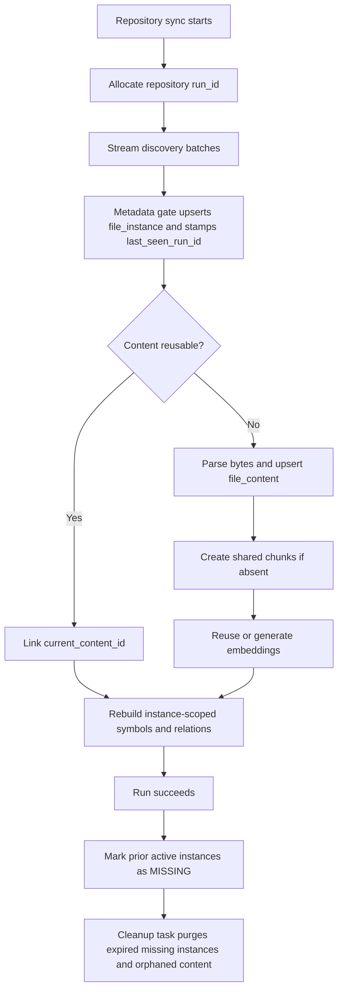

# File Instance / File Content Implementation Plan

## Snapshot

- Date: 2026-03-18
- Status: `🧭` active execution plan
- Depends on: `docs/architecture/file_instance_content_dedup_proposal.md`

## Objective

Implement the content/instance split with the smallest validated vertical slices:

1. separate file-instance identity from reusable file-content identity
2. keep symbols and graph relations instance-scoped
3. move chunks and embedding reuse onto content ownership
4. implement streaming-friendly missing detection using successful run IDs
5. finalize missing rows via TTL cleanup

## Confirmed Decisions

`✅` fixed, `🚧` later.

| Decision | Status | Notes |
| --- | --- | --- |
| Database reset is acceptable | `✅` | No backward-compatibility migration is required for this fork |
| Final symbols remain instance-scoped | `✅` | Path and repository context are fundamental |
| Shared content artifacts start with chunks + embeddings | `✅` | First reusable layer |
| Missing detection uses successful increasing run IDs | `✅` | No full in-memory file-list reconciliation |
| Failed runs do not mark files missing | `✅` | Finalization only on successful run completion |
| Parse-pattern shortcuts may be explored later | `🚧` | Explicitly not part of this implementation wave |

## Scope

`✅` in scope, `🛑` out of scope for this plan.

| Area | Status | Notes |
| --- | --- | --- |
| `file_instances` table/model | `✅` | Replaces current file-centric identity role |
| `file_contents` table/model | `✅` | Canonical reusable content identity |
| Repository-scoped indexing runs | `✅` | Needed for streaming-friendly missing detection |
| Content-owned chunks | `✅` | First shared derived artifact |
| Embedding reuse through shared chunks/content | `✅` | Extends current hash reuse logic |
| Active vs missing instance lifecycle | `✅` | Explicit query/count semantics |
| TTL cleanup for missing instances | `✅` | Required to complete soft deletion |
| Shared symbol rows | `🛑` | Not part of this architecture |
| Shared relation graph | `🛑` | Not part of this architecture |
| Parse-pattern optimization layer | `🛑` | Future work after baseline stabilization |

## Target Runtime Model

## Schema Plan

### Core Tables

| Table | Purpose | Notes |
| --- | --- | --- |
| `repositories` | unchanged root entity | may gain `next_run_id` helper if desired |
| `repository_index_runs` | repository-scoped run tracking | success/failure controls missing sweep |
| `file_instances` | repository/path/lifecycle identity | replaces current `files` identity role |
| `file_contents` | canonical reusable content identity | keyed by content hash + parser fingerprint |
| `chunks` | content-owned retrieval units | migrate from file-owned to content-owned |
| `symbols` | instance-owned extracted graph nodes | re-key from file to file instance |

### Proposed Minimal Columns

#### `repository_index_runs`

| Column | Purpose |
| --- | --- |
| `id` | PK |
| `repository_id` | owning repository |
| `run_id` | strictly increasing per repository |
| `status` | `RUNNING`, `SUCCEEDED`, `FAILED` |
| `started_at` | run start |
| `completed_at` | run completion |
| `failure_reason` | optional summary for failed runs |

Uniqueness:

- unique `(repository_id, run_id)`

#### `file_instances`

| Column | Purpose |
| --- | --- |
| `id` | PK |
| `repository_id` | owning repository |
| `path` | relative path |
| `language` | detected language |
| `size_bytes` | latest observed size |
| `last_modified` | latest observed mtime |
| `lifecycle_state` | `ACTIVE` or `MISSING` in v1 |
| `current_content_id` | FK to `file_contents` |
| `last_seen_run_id` | most recent successful run that observed file present |
| `first_seen_at` | first observation time |
| `last_seen_at` | latest successful observation time |
| `missing_since` | first absent observation time |
| `created_at` / `updated_at` | audit fields |

Uniqueness:

- unique `(repository_id, path)`

#### `file_contents`

| Column | Purpose |
| --- | --- |
| `id` | PK |
| `content_hash` | canonical bytes identity |
| `language` | parser language |
| `parser_fingerprint` | parser/query bundle/version |
| `size_bytes` | content size |
| `line_count` | reusable metadata |
| `created_at` | first materialization |
| `last_reused_at` | most recent link/reuse |

Uniqueness:

- unique `(content_hash, language, parser_fingerprint)`

## Ownership Plan

| Entity | Owner in target model | Rationale |
| --- | --- | --- |
| file path and lifecycle | `file_instances` | source-context identity |
| current content link | `file_instances.current_content_id` | one instance points at latest content |
| chunks | `file_contents` | pure content-derived artifact |
| embeddings | chunk/content path | reuse identical content embeddings |
| symbols | `file_instances` | path and repository context matter |
| relations | symbol path | remain graph-context-specific |

## Run-ID Allocation Plan

### Recommended Implementation

Use a repository-scoped run table plus a monotonic allocator:

1. lock repository sync start
2. allocate next `run_id`
3. insert `repository_index_runs(status=RUNNING)`
4. propagate `run_id` through discovery, metadata gate, parsing, and finalization
5. mark run `SUCCEEDED` only after all downstream barriers complete

### Allocation Options

| Option | Status | Notes |
| --- | --- | --- |
| `repository_index_runs` + `max(run_id) + 1` under row lock | `🧭` | simplest explicit model |
| `repositories.next_run_id` counter column | `🧭` | slightly faster, but adds mutable counter state |

Recommendation:

- Start with `repository_index_runs` plus repository row lock.
- Add cached counter only if allocator contention shows up in practice.

## Execution Slices

`🧭` next action, `🚧` later.

| Slice | Status | Outcome |
| --- | --- | --- |
| 1. Schema reset and model rewrite | `🚧` | core ORM entities landed; broader query-surface rewrite still pending |
| 2. Run allocation and stamping | `🚧` | sync/discovery/gate path now stamps `last_seen_run_id` |
| 3. Content upsert and linking | `🚧` | file upsert now creates/links canonical content rows |
| 4. Content-owned chunks and embedding reuse | `🧭` | shared chunk/embedding materialization works |
| 5. Missing finalization pass | `🚧` | successful syncs now mark older active instances as `MISSING` |
| 6. TTL cleanup and orphan content GC | `🚧` | cleanup worker/task landed; broader integration validation still pending |

## Current Increment (2026-03-18)

`✅` implemented in this increment, `🚧` partial.

| Increment | Status | Notes |
| --- | --- | --- |
| Add `RepositoryIndexRun`, `FileInstance`, and `FileContent` ORM entities | `✅` | New target model landed in `src/database/models.py` |
| Preserve compatibility import surface via `File = FileInstance` alias | `✅` | Limits immediate blast radius during transition |
| Stamp `last_seen_run_id` during discovery/metadata gate and parsing paths | `✅` | Current run ID is threaded through pipeline metadata |
| Finalize missing rows only after successful sync completion | `✅` | Failed runs skip missing-mark behavior |
| Count repository file size/count/symbol totals from active instances | `✅` | Sync completion path now filters to active rows |
| Apply active-instance filtering in main API/MCP read paths | `🚧` | Repository stats, symbol APIs, and main MCP repository/search/navigation tools now default to active rows |
| Move chunks to fully shared content-scoped ownership | `🚧` | Transitional chunk model keeps instance linkage while `file_content_id` is introduced |
| Add TTL cleanup worker for expired missing instances and orphan content reclamation | `✅` | Celery task + beat schedule + cleanup metrics are now present |

## Slice 1: Schema Reset And Model Rewrite

### Code changes

1. Replace current file-centric schema with explicit run/instance/content entities.
2. Re-key symbols from `file_id` to `file_instance_id`.
3. Re-key chunks from `file_id` to `file_content_id`.
4. Update ORM relationships and query helpers accordingly.

### Target files

- `src/database/models.py`
- migration/bootstrap schema files used by local reset flow
- any repositories/services that directly query `File`

### Acceptance criteria

1. Schema initializes cleanly from scratch.
2. ORM loads repository -> instance -> content relationships correctly.
3. Existing file-centric code paths fail only where expected and are tracked for next slices.

## Slice 2: Run Allocation And Stamping

### Code changes

1. Allocate `run_id` at repository sync start.
2. Persist `repository_index_runs(status=RUNNING)`.
3. Thread `run_id` through `PipelineContext`, discovery payloads, and metadata gate processing.
4. Stamp each observed `file_instance.last_seen_run_id = current_run_id`.

### Target files

- `src/workers/sync_worker.py`
- `src/workers/pipeline/context.py`
- `src/workers/pipeline/steps/discovery_step.py`
- `src/workers/inventory_worker.py`

### Acceptance criteria

1. Every successful sync has one completed run row.
2. All observed files in that sync carry the current run ID.
3. Failed runs remain recorded as failed and do not alter missing state.

## Slice 3: Content Upsert And Linking

### Code changes

1. Replace `create_or_update_file()` with instance/content-aware upsert helpers.
2. Metadata gate decides:
   - unchanged instance metadata with same linked content => reuse
   - changed/new bytes => parse and upsert `file_content`
3. Link `file_instance.current_content_id` after content resolution.
4. Preserve current hash-based reuse behavior, but anchor it to `file_contents`.

### Target files

- `src/workers/file_worker.py`
- `src/workers/inventory_worker.py`
- `src/workers/utils.py`
- parser/extractor entry points that read current file ownership

### Acceptance criteria

1. Two instances with identical content can point at one content row.
2. Repeated unchanged reruns do not create new content rows.
3. Changed content produces a new or reused `file_content` row as appropriate.

## Slice 4: Content-Owned Chunks And Embedding Reuse

### Code changes

1. Materialize chunks under `file_content_id`.
2. Update embedding generation to operate through content-owned chunks.
3. Keep current model/version reuse logic, but move it to content-owned chunk identity.
4. Ensure instance rebuild does not duplicate shared chunks.

### Target files

- `src/extractors/knowledge_extractor.py`
- `src/database/models.py`
- `src/workers/embedding_worker.py`
- `src/workers/pipeline/steps/embedding_step.py`
- `src/vector_store/pgvector_store.py`

### Acceptance criteria

1. Identical content across multiple instances yields one shared chunk set.
2. Embedding generation remains bounded to new shared chunks only.
3. Unchanged reruns perform zero duplicate chunk creation.

## Slice 5: Missing Finalization Pass

### Code changes

1. On successful run completion only, execute one repository-scoped finalization query:
   - `ACTIVE` instances with `last_seen_run_id < current_run_id` become `MISSING`
2. Set `missing_since` on first transition only.
3. Update repository stats/query paths to count only `ACTIVE` instances.

### Target files

- `src/workers/sync_worker.py`
- repository statistics services/routes
- any MCP/API query path that currently treats all file rows as active

### Acceptance criteria

1. Deleted files are not marked missing until a run succeeds fully.
2. Active repository file counts exclude `MISSING` rows.
3. Reintroduced files transition from `MISSING` back to `ACTIVE` by later successful runs.

## Slice 6: TTL Cleanup And Orphan Content GC

### Code changes

1. Add cleanup task for `MISSING` instances older than TTL.
2. Delete instance-scoped artifacts for expired missing rows.
3. Delete orphaned `file_contents` rows only when no active or missing instances reference them.
4. Add metrics/logging for purged instances, reclaimed contents, and skipped content rows still in use.

### Target files

- new cleanup worker/task module
- `src/workers/celery_app.py`
- stats/metrics modules

### Acceptance criteria

1. TTL cleanup is idempotent.
2. Shared content is not reclaimed while still referenced.
3. Storage shrinks after missing rows age out.

## Query Semantics

### Required defaults

| Query type | Default instance filter |
| --- | --- |
| Repository file counts | `ACTIVE` only |
| Normal code search and traversal | `ACTIVE` only |
| Operational/debug views | selectable `ACTIVE` and `MISSING` |
| Cleanup jobs | `MISSING` older than TTL |

### Non-goal

- No user-facing history browser is introduced in this plan.

## Risks

`🔥` risk, `🧭` mitigation.

| Risk | Status | Mitigation |
| --- | --- | --- |
| Re-keying chunks/symbols touches many code paths | `🔥` | land schema slice first and validate progressively |
| Missing query filters may leak `MISSING` rows into active APIs | `🔥` | centralize active-instance filtering helpers early |
| Content GC can delete shared rows too aggressively | `🔥` | require reference check in same transaction |
| Parser fingerprint drift may cause incorrect content sharing | `🔥` | make parser fingerprint explicit and versioned from day one |

## Validation Plan

`✅` required.

| Validation | Gate |
| --- | --- |
| Fresh sync on clean DB creates run, instance, content, chunk, symbol rows coherently | `✅` |
| Unchanged rerun reuses content/chunks/embeddings and does not mark files missing | `✅` |
| Successful run after file deletion marks only absent files `MISSING` | `✅` |
| Failed run after partial discovery does not mark files missing | `✅` |
| TTL cleanup purges expired missing instances and only orphaned content | `✅` |
| Reintroduced file reactivates existing/new content correctly | `✅` |

## Suggested Test Order

1. schema bootstrap smoke check
2. integration test for identical-content reuse across two paths
3. integration test for successful deletion -> `MISSING`
4. integration test for failed run -> no missing sweep
5. integration test for TTL cleanup + orphan content preservation

## Immediate Next Task

Start Slice 1 with a reset-friendly schema rewrite and explicit ORM target model for:

1. `repository_index_runs`
2. `file_instances`
3. `file_contents`
4. re-keyed `symbols` and `chunks`
