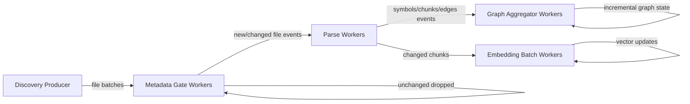

# Incremental Indexing Spec (Experimental, Streaming-First)

## Objective

Define an async streaming indexing architecture that:

1. Continuously ingests filesystem/repository changes as batches/events.
2. Uses persisted metadata to skip unnecessary parsing work.
3. Parallelizes discovery, gating, parsing, aggregation, and embedding.
4. Minimizes DB round-trips through batch-first access patterns.

## Direction

The indexer is an asynchronous streaming system.

- No global run-finalization concept is introduced.
- Work is modeled as continuous flow through queues/workers.
- State is continuously improved toward latest observed input.

## Scope

`✅` in-scope, `🛑` out-of-scope for first increment.

| Area | Status | Notes |
| --- | --- | --- |
| Streaming discovery events/batches | `✅` | Core architecture target |
| Batch metadata gating before parse | `✅` | Primary performance control point |
| Changed/new-only parsing | `✅` | Prevent unnecessary parser CPU + DB writes |
| Incremental graph aggregation workers | `✅` | Shared graph updates from parse outputs |
| Changed-chunk-only embedding batching | `✅` | Major cost reduction path |
| Symbol-level hash diff inside changed files | `🛑` | Defer until file-level strategy is stable |

## Current Persisted File Metadata

The `files` table already stores fields usable for incremental gating:

| Field | Persisted | Currently used as skip gate |
| --- | --- | --- |
| `path` | `✅` | `✅` (identity) |
| `size_bytes` | `✅` | `🛑` |
| `content_hash` | `✅` | `🛑` |
| `line_count` | `✅` | `🛑` |
| `last_modified` | `✅` (persisted for newly/updated files) | `🛑` |

## Streaming Pipeline Model

## Work Unit Contracts

### Discovery batch message

- `repository_id`
- `batch_id`
- `paths[]`
- `observed_at`

### Metadata gate output

- `repository_id`
- `batch_id`
- `unchanged_paths[]`
- `changed_paths[]`
- `new_paths[]`
- `decision_stats`

### Parse output event

- `repository_id`
- `file_id/path`
- `content_hash`
- `symbol/chunk/edge payload refs`
- `produced_at`

## Incremental Decision Policy

For each discovered file:

1. If file path not in DB -> `NEW`
2. If `size_bytes` matches and `last_modified` matches -> `UNCHANGED`
3. Else, if `last_modified` missing or mismatched, compare `content_hash`:
   - If hash matches -> `UNCHANGED`
   - Else -> `CHANGED`

## DB Access Strategy

### Mandatory

1. Bulk-fetch existing metadata for all paths in each incoming batch.
2. Use set-based reads/writes over per-file/per-symbol chatty queries.
3. Keep file-level writes idempotent.

### Avoid

1. Full repository rescans before every parse action.
2. Per-symbol existence checks in tight loops.
3. Re-writing unchanged file entities.

## Embedding Strategy

1. Parse workers emit changed/new chunks only.
2. Embedding workers process chunks in configurable batches.
3. Embeddings are updated only for changed chunk identities.

## Observability

Track streaming health with:

1. Queue lag per stage (`discovery`, `metadata_gate`, `parse`, `aggregate`, `embed`).
2. Throughput (files/sec, chunks/sec, embeddings/sec).
3. Drop/skip ratios (`unchanged`, `changed`, `new`).
4. Retry/error rates by stage.

## Situation Report

`✅` implemented today, `🚧` partial, `🛑` not yet implemented.

| Capability | Status | Evidence / Notes |
| --- | --- | --- |
| Parallel worker runtime (Celery) | `✅` | Worker queues already configured (`repository_sync`, `file_parsing`, `embeddings`, etc.) |
| Repository source abstraction (git + local dir) | `✅` | Runtime source registry integrated in clone/discovery/worker paths |
| Persisted file metadata fields (`size_bytes`, `content_hash`) | `✅` | `create_or_update_file()` updates these fields |
| File metadata used to skip parsing | `🛑` | Current parsing step still iterates all discovered files |
| Streaming discovery producer emitting batches | `🛑` | Discovery currently runs inside monolithic sync task |
| Metadata gate worker stage | `🛑` | Not present |
| Changed/new-only parse fanout | `🛑` | Not present |
| Incremental graph aggregator workers | `🚧` | Graph logic exists, but not event-driven from parse outputs |
| Changed-chunk-only embedding batching | `🚧` | Embedding worker exists; no strict changed-chunk contract yet |
| Retry-safe context rehydration in pipeline checkpoints | `✅` | Clone/discovery replay logic added for context hydration on retries |

## Required Changes (Execution Backlog)

1. Introduce discovery batch producer that emits path batches.
2. Implement metadata gate stage with bulk DB metadata fetch per batch.
3. Persist `last_modified` immediately on file upsert/update, with resilient fallback to hash gate when missing.
4. Emit parse jobs only for `NEW/CHANGED` files.
5. Add parse output event schema for aggregators and embedding workers.
6. Move graph consolidation to incremental aggregator workers.
7. Enforce changed-chunk-only embedding updates with batch writes.
8. Add queue-lag and stage-throughput metrics as first-class telemetry.

## Approved Decisions

1. Primary gate is `size + mtime`; hash is fallback when mtime is missing or mismatched.
2. `last_modified` persistence is implemented immediately; no migration dependency is required.
3. Full async streaming flow is implemented end-to-end before the next indexing validation run.
4. Embedding stage changes are included in that same end-to-end flow implementation.
