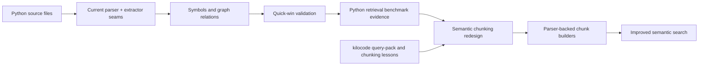

# Python Quick-Win And Semantic Search Plan

## Snapshot

- Date: 2026-03-19
- Goal: Ship Python capability wins quickly, then use those gains to drive a later semantic-search overhaul that matches or exceeds kilocode's chunking usefulness

## Why This Plan Exists

Python currently has the clearest gap between:

- what Axon can already parse structurally
- what Axon can already retrieve usefully
- what the fork direction says should be a first-class language

This plan intentionally separates:

1. **Python graph parity**
2. **semantic-search chunking overhaul**

That separation is deliberate.

The quick-win path should not be blocked on a larger parser-platform refactor, but the later semantic-search overhaul should still learn from kilocode's strongest ideas:

- language-specific query packs
- parser-backed coherent chunk boundaries
- explicit fallback chunking policy
- regression suites for retrieval-oriented parsing behavior

## Decision

`✅` decided, `🧭` next, `🔥` risk.

| Topic | Status | Decision |
| --- | --- | --- |
| Python quick wins before parser refactor | `✅` | Deliver Python imports/calls/endpoints first on the current architecture where feasible. |
| Full parsing/chunking refactor required before Python parity | `🛑` | Do not block Python parity on that refactor. |
| Later semantic-search overhaul | `🧭` | Use shipped Python graph improvements plus benchmark evidence to guide a retrieval-focused redesign. |
| kilocode reuse model | `✅` | Reuse ideas and test patterns, not the full runtime or indexing architecture. |

## Working Model

## Phase Plan

`✅` completed, `🧭` next, `🚧` partial, `🔥` risk.

| Phase | Status | Focus | Why now |
| --- | --- | --- | --- |
| P0. Establish current Python baseline | `✅` | Confirm Python already has discovery, symbol extraction, and dependency manifest support. | Starting point is already known. |
| P1. Python import quick win | `✅` | Persist `IMPORTS` edges for intra-repo Python imports. | Smallest vertical slice with immediate user-visible value. |
| P2. Python call quick win | `✅` | Add Python `CALLS` extraction using a Python-specific AST strategy seam. | High-value graph improvement without waiting on tree-sitter refactor. |
| P3. Python endpoint quick win | `✅` | Add FastAPI/Flask baseline endpoint extraction. | Gives immediate practical value on real Python service repos. |
| P4. Python parity validation | `🚧` | Add focused Python integration and retrieval benchmarks. | Focused integration tests are landed; retrieval benchmark seeding is now explicit and the live benchmark run remains next. |
| P5. Semantic-search overhaul | `🚧` | Redesign retrieval chunking using kilocode-inspired parser-backed chunk builders plus Axon-native graph/context strengths. | Can now start in thin retrieval-only slices because Python graph truth is stronger. |

## Phase P1: Python Import Quick Win

### Scope

- Use the existing `PythonParser` import output
- add a `PythonImportStrategy`
- persist `IMPORTS` relations for:
  - `import pkg.module`
  - `from pkg import name`
  - `from .subpackage import name`
  - `from ..pkg import module`

### Non-goals

- no tree-sitter migration
- no editor-style `gotoDefinition` logic
- no attempt to resolve external site-packages imports into graph edges

### Acceptance

1. Intra-repo Python imports create `IMPORTS` edges.
2. Relative imports resolve correctly for normal package layouts.
3. Imports inside strings/comments do not create false relations.
4. Focused integration coverage exists.

### Remaining Parser-Fidelity Work

These items are intentionally deferred from the quick-win slice and still need follow-up work:

- preserve alias information for `import x as y` and `from x import y as z`
- emit structured import records instead of flat strings
- distinguish imported modules, imported symbols, and wildcard imports at parse level
- consider dynamic import patterns such as `importlib.import_module(...)` only if benchmarked retrieval or graph use-cases justify it
- model `__init__.py` re-export/package-surface semantics when they materially affect resolution quality

## Phase P2: Python Call Quick Win

### Scope

- add a Python-specific call extraction strategy
- keep it separate from JS/Java tree-sitter-only assumptions
- support common patterns first:
  - direct function calls
  - `self.method()`
  - `obj.method()` where symbol context is locally inferable

### Design Constraint

Do not force Python into the current tree-sitter symbol-node contract.

Instead:

- define an AST-compatible strategy seam
- let JS/Java continue using tree-sitter-backed paths
- let Python operate on builtin `ast`-derived information

### Acceptance

1. Common intra-repo Python calls create `CALLS` edges.
2. The shared call path remains explicit about which languages use which AST model.
3. New Python support does not regress current JS/Java call extraction.

## Phase P3: Python Endpoint Quick Win

### Scope

Ship the minimum framework coverage that answers real service-repo questions:

- FastAPI:
  - `@app.get(...)`
  - `@app.post(...)`
  - `@router.get(...)`
  - `@router.post(...)`
- Flask:
  - `@app.route(...)`
  - method-specific decorators where applicable
  - blueprint route decorators

### Non-goals

- no Django parity in the first slice
- no framework-generic abstraction beyond what is needed for FastAPI/Flask

### Acceptance

1. Endpoint symbols are created for common FastAPI and Flask route declarations.
2. Search and context tools can retrieve those endpoints meaningfully.
3. Integration fixtures cover at least one FastAPI and one Flask example.

## Phase P4: Python Validation Gate

### Required Artifacts

- targeted Python integration tests for imports
- targeted Python integration tests for calls
- targeted Python integration tests for endpoints
- retrieval benchmark seeds for one Python-heavy corpus

### Success Criteria

| Area | Gate |
| --- | --- |
| Imports | Topology is correct on representative package-relative examples |
| Calls | Common service-layer flows create usable `CALLS` edges |
| Endpoints | Service entrypoints are retrievable by route intent queries |
| Retrieval | Python intent queries are benchmarked before chunking overhaul begins |

## Phase P5: Semantic Search Optimization Overhaul

This phase starts **after** Python quick wins are shipped and benchmarked.

### Core Thesis

Semantic-search chunking should become a first-class subsystem, not just a side effect of symbol extraction.

### Lessons To Reuse From kilocode

`✅` reuse, `🛑` do not copy directly.

| kilocode lesson | Status | How Axon should use it |
| --- | --- | --- |
| Per-language query packs | `✅` | Use for retrieval-oriented chunk boundaries where parser support is strong. |
| Coherent parser-backed blocks | `✅` | Use to define chunk candidates that are better than naive symbol-only slices. |
| Explicit fallback chunking policy | `✅` | Keep and expand Axon's fallback chunking with clearer capability signaling. |
| Large language-extension registry | `✅` | Reuse the pattern, not the TS implementation. |
| Pure vector search contract | `🛑` | Axon should keep hybrid search and graph-aware follow-up strengths. |
| Full kilocode indexing runtime | `🛑` | Axon should not replace its graph-native architecture with kilocode's chunk-only approach. |

### Target Design

Separate:

1. **Graph truth builders**
   - symbols
   - imports
   - calls
   - endpoints
   - dependencies

2. **Retrieval chunk builders**
   - parser-backed definition chunks
   - grouped decorator + definition chunks
   - framework/context chunks
   - file-level fallback chunks
   - docs/config intent chunks

### Planned Overhaul Slices

| Slice | Status | Scope |
| --- | --- | --- |
| S1. Capability signaling for chunk builders | `🧭` | Make parser-backed vs fallback-backed chunk behavior explicit by file type/language. |
| S2. Python retrieval chunk builder | `🚧` | Start with decorator-aware Python chunks so FastAPI/Flask route context is embedded with the definition body instead of being dropped. |
| S3. Search benchmark comparison vs pre-overhaul baseline | `🧭` | Prove chunking changes improved usefulness before broader rollout. |
| S4. Cross-language chunk-builder platform | `🧭` | Generalize only after Python proves the design. |

## Current Retrieval Increment (2026-03-19)

`🚧` partially implemented in this increment.

| Increment | Scope | Validation |
| --- | --- | --- |
| Python decorator-aware chunk coherence | Preserve Python decorators in retrieval chunk bodies and metadata so FastAPI/Flask route declarations stay semantically attached to the symbol they describe | Verified on 2026-03-19 by running `tests/unit/test_python_parser.py` and `tests/unit/test_symbol_chunker.py` against the local devcontainer Python environment |
| Call-neighbor retrieval context | Include incoming `called_by` context in chunk content/metadata so service-flow and entrypoint-to-helper queries have graph-adjacent retrieval text | Verified on 2026-03-19 by running `tests/unit/test_symbol_chunker.py` against the local devcontainer Python environment |

## Execution Order

1. Land Python `IMPORTS`.
2. Land Python `CALLS`.
3. Land Python FastAPI/Flask endpoint extraction.
4. Run Python retrieval benchmarks.
5. Identify where retrieval is still weak because chunk boundaries/content are poor.
6. Only then start the semantic-search chunking overhaul.

## Current Recommendation

The next implementation increment should be:

1. Python import quick win
2. focused regression coverage
3. no parser-platform refactor in the same slice

That gives the fastest route to visible Python capability while preserving a clean path to a later retrieval overhaul.
