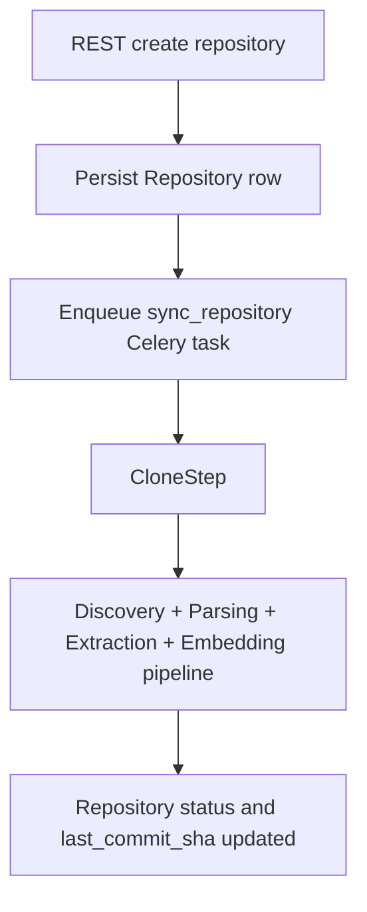
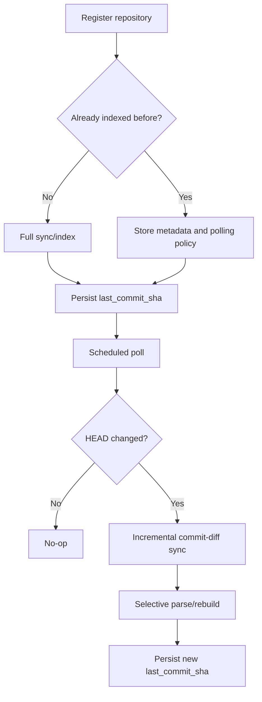

# Repository Registration And Sync Architecture

## Scope

Define the product-level repository onboarding and refresh model for Axon.

This document is the canonical reference for:
- repository registration
- initial indexing after registration
- recurring refresh/poll behavior
- incremental commit-diff processing
- future MCP registration/sync exposure

Related docs:
- runtime source abstraction: `docs/architecture/repository_source_abstraction.md`
- streaming/file-metadata incremental ideas: `docs/architecture/incremental_indexing_spec.md`
- file/content lifecycle architecture: `docs/architecture/file_instance_content_dedup_proposal.md`

## Current State

`✅` implemented, `🚧` partial, `🛑` not implemented.

| Area | Status | Notes |
| --- | --- | --- |
| REST endpoint to register one repository | `✅` | `POST /api/v1/repositories` creates the DB row and enqueues the first sync |
| REST endpoint to register one repository from URL only | `🚧` | Next increment: accept a GitHub/generic HTTP URL and derive provider/name/path/clone metadata server-side |
| REST endpoint to bulk-register repositories | `✅` | `POST /api/v1/repositories/bulk-add` exists |
| Immediate initial indexing after registration | `✅` | Registration triggers background sync automatically |
| Runtime git source abstraction | `✅` | Runtime resolves between generic git and local-directory sources |
| Local-directory indexing through standard pipeline | `✅` | Supported through repository metadata + source resolver |
| Public provider enum for generic Git/GitHub | `✅` | Public API now accepts `GITLAB`, `GITHUB`, and `GIT` |
| GitLab discovery flow | `✅` | Group discovery route exists |
| Generic Git/GitHub registration through public API | `✅` | Create and bulk-add now accept provider-neutral registration payloads |
| Periodic polling for new commits | `✅` | Celery Beat enqueues scheduled refresh for tracked repositories |
| Incremental commit-diff sync worker | `✅` | `IncrementalSyncWorker` exists and has integration coverage |
| Incremental commit-diff sync wired into production orchestration | `✅` | The normal sync entrypoint now prefers incremental refresh when safe |
| MCP tool to register repositories | `🛑` | MCP currently exposes read/navigation tools only |
| MCP tool to trigger repository sync | `🛑` | Not exposed today |

## Current Runtime Flow

## Current Product Constraints

### What is already true

1. Repository registration is API-driven, not config-only.
2. Initial indexing already happens automatically after registration.
3. Runtime sync code already has the primitives needed for generic git and local-directory sources.
4. A commit-aware incremental worker already exists for modifications-only processing.

### What is not yet true

1. GitLab discovery is still the only provider-specific discovery workflow.
2. Credentials are still configured globally by provider/runtime settings rather than per repository.
3. MCP does not yet expose repository registration or sync initiation.

## Current Implementation Slice

This increment implements the minimum production contract for repository onboarding and refresh:

1. add `GIT` and `GITHUB` to the public provider model
2. keep GitLab discovery, but remove the `GITLAB`-only restriction from the registration path
3. decouple clone authentication from GitLab-only token injection
4. make the main sync entrypoint choose:
   - full sync for first index or unsafe states
   - incremental commit-diff sync after the repository has a known `last_commit_sha`
5. add a Celery Beat poller that enqueues refresh for tracked repositories on a fixed interval
6. add a URL-derived registration endpoint so callers do not need to pre-fill `name`, `path_with_namespace`, and `clone_url` for GitHub/generic HTTPS remotes

Non-goals for this increment:

1. webhook-driven refresh
2. MCP repository registration/sync tools
3. per-repository polling policies or credentials stored in the database

## Repository Access Model

## Current

`✅` active, `🚧` partial, `🛑` missing.

| Concern | Status | Notes |
| --- | --- | --- |
| GitLab API discovery | `✅` | Explicit GitLab client + discovery route |
| Generic git clone/update runtime | `✅` | Available through `GitRepositorySource` |
| Local path indexing | `✅` | Available through `LocalDirectorySource` |
| Provider-neutral credential model | `✅` | HTTPS clone/update auth now branches by provider/runtime settings instead of GitLab-only token injection |
| GitHub/private generic Git credential handling | `✅` | Runtime settings support GitHub token auth and generic HTTPS username/token auth |

## Target Product Flow

## Recommended Direction

### Provider model

Move from a GitLab-shaped public model toward:

| Provider | Purpose | Status |
| --- | --- | --- |
| `GITLAB` | GitLab-specific discovery and API integration | `✅` current |
| `GITHUB` | GitHub-specific integration when API-specific discovery/webhooks are needed | `🧭` recommended |
| `GIT` | Provider-neutral git registration for any cloneable remote | `🧭` recommended |
| `LOCAL_DIRECTORY` or existing local-path contract | Local benchmark/offline indexing | `🧭` keep supported |

### Sync orchestration policy

Recommended product behavior:

1. Registration performs an initial full sync.
2. After a repository has a known `last_commit_sha`, scheduled refresh should prefer commit-diff incremental sync.
3. Full sync remains the fallback when:
   - the repository has never been indexed
   - the previous commit is unknown
   - the diff window is invalid or clone state is inconsistent
   - a forced/full reindex is requested

## Best Documentation Shape

Recommended approach: `hybrid`

### Add a new canonical doc

This document should remain the product-level source of truth for:
- current repository registration/sync behavior
- target provider support
- poll/incremental orchestration decisions
- MCP registration/sync direction

### Keep existing docs narrow and accurate

Update existing docs, but do not overload them:

| Doc | Role |
| --- | --- |
| `docs/api/rest_api.md` | Current shipped REST surface |
| `docs/api/mcp_tools.md` | Current shipped MCP tool surface |
| `docs/architecture/repository_source_abstraction.md` | Runtime source-resolution mechanics only |
| `docs/architecture/incremental_indexing_spec.md` | Streaming/file-metadata incremental ideas, not product polling orchestration |

## Execution Backlog

`🧭` next action, `🔥` risk.

| Item | Status | Notes |
| --- | --- | --- |
| Document current registration/sync state clearly | `✅` | This doc + linked API docs |
| Introduce provider enum/support for `GIT` and likely `GITHUB` | `✅` | Public registration and runtime support are landed |
| Decouple clone auth from GitLab-only token injection | `✅` | Provider-aware HTTPS auth is landed |
| Add scheduled poller for registered repositories | `✅` | Celery Beat now enqueues repository refresh |
| Wire commit-diff incremental worker into poll flow | `✅` | Main sync task now attempts incremental refresh first |
| Add MCP registration/manual sync tools | `🧭` | Product UX enhancement after REST contract stabilizes |
| Add webhook-triggered refresh later | `🚧` | Useful later, but polling is the simpler first contract |
| Add URL-derived single-repo registration | `🚧` | REST should accept a plain GitHub/generic HTTPS repo URL and infer provider metadata |

## Acceptance Criteria

`✅` required.

| Criterion | Gate |
| --- | --- |
| A repository can be registered through a stable public API contract | `✅` |
| A GitHub or generic HTTPS repository can be registered with just its URL | `🚧` |
| New registrations trigger initial indexing automatically | `✅` |
| Registered repositories can be refreshed on a schedule without manual intervention | `✅` |
| Incremental commit-diff sync is used after the initial full index when safe | `✅` |
| Generic Git/GitHub support is explicit in the provider and credential model | `✅` |
| MCP support for repository registration/sync is explicitly documented as present or absent | `✅` |
