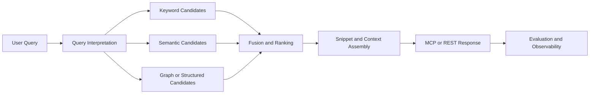

# Retrieval Improvement Plan

## Objective

Improve Axon's retrieval usefulness across API and MCP clients by making search, graph navigation, and architecture-context tools more reliable, better ranked, and easier to chain together in real developer workflows.

## Scope

This plan covers:
- code search
- documentation/config/path retrieval
- symbol and graph-context retrieval
- architecture and system-context retrieval
- retrieval evaluation, ranking, and observability

This plan does not move ownership of indexing production concerns away from the indexing workstream.

## Retrieval Flow

## Current Baseline

`✅` shipped, `🚧` partial, `🛑` missing.

| Area | Status | Notes |
| --- | --- | --- |
| Hybrid symbol search | `✅` | `SearchService` supports keyword + semantic search with reciprocal-rank fusion. |
| Codex app MCP connectivity | `✅` | Local Codex app sessions can now connect to the Axon HTTP MCP server and see the Axon tool surface. MCP resources/templates remaining empty is expected for this tool-oriented integration. |
| Documentation/config/path retrieval | `✅` | Shipped through MCP tool handlers and backing database queries. |
| Symbol context and graph navigation | `✅` | Multiple retrieval tools are already exposed through the MCP router. |
| Architecture-context retrieval | `🚧` | Tool surface exists, but usefulness depends on service mapping, summaries, and relation quality. |
| Query intent routing | `🚧` | Some tools are specialized, but there is no explicit retrieval-layer intent model or evaluation contract. |
| Retrieval evaluation set | `🛑` | No canonical benchmark queries or acceptance thresholds exist. |
| Retrieval observability | `🚧` | Metrics exist for some search/tool paths, but there is no retrieval-quality instrumentation loop yet. |

## Workstream Boundary

`✅` owned here, `🤝` dependency on indexing.

| Concern | Ownership | Notes |
| --- | --- | --- |
| Ranking, fusion, result usefulness, and tool chaining | `✅` | Retrieval-owned behavior and acceptance criteria. |
| Snippet selection and response packaging | `✅` | Retrieval should define how much context is surfaced and in what shape. |
| Corpus freshness, symbols, relations, chunks, embeddings | `🤝` | Produced by indexing; retrieval consumes these artifacts and records quality dependencies. |
| Upstream graph/data quality requests | `🤝` | Retrieval can define explicit contracts and failure cases but should avoid ad hoc indexing refactors. |

## Success Criteria

`🧭` define in Phase 1, then measure continuously.

| Metric | Why it matters | Phase 1 output |
| --- | --- | --- |
| Top-k usefulness on curated developer queries | Primary relevance signal | Seed benchmark set with expected useful outcomes |
| Search-to-context chain success | Measures whether results lead to the next useful tool call | Follow-up scenarios for `search_code -> get_symbol_context` and related flows |
| Architecture query usefulness | Ensures higher-level tools are not just present but actionable | Seed scenarios for project map, module summary, request-flow, and codebase-structure queries |
| Warm-path latency | Keeps retrieval practical in interactive use | Baseline timing targets for representative queries |
| Docs/implementation parity | Prevents drift and false assumptions | Explicit doc audit and canonical references |

## Phased Plan

`✅` completed, `🧭` next, `🚧` partial, `🔥` risk.

| Phase | Status | Focus | Risk |
| --- | --- | --- | --- |
| R1. Retrieval baseline and truth alignment | `🧭` | Inventory shipped retrieval behavior, align docs, define benchmark seed set, and record upstream dependencies. | `🔥` Teams may optimize the wrong layer without a shared baseline. |
| R2. Search ranking and result packaging | `🧭` | Improve query normalization, keyword/semantic fusion, snippet selection, and result ordering. | `🔥` Heuristic changes can regress known workflows without benchmark coverage. |
| R3. Graph and symbol-context retrieval quality | `🧭` | Improve `get_symbol_context`, usages/references, call navigation, and search-to-graph transitions. | `🔥` Quality depends on upstream relation fidelity, especially for Java. |
| R4. Architecture-context retrieval quality | `🧭` | Improve project/module/system/request-flow retrieval usefulness and clarify when these tools should be used. | `🔥` Architecture tools can look broad but fail on sparse service or relation data. |
| R5. Retrieval observability and regression discipline | `🧭` | Add usefulness/latency regressions, benchmark reporting, and retrieval-facing metrics. | `🔥` Retrieval quality work drifts quickly without recurring evidence. |

## Recommended Execution Slices

`🧭` recommended next slices in dependency order.

| Slice | Status | Why first |
| --- | --- | --- |
| R1A. Retrieval surface audit and doc alignment | `🧭` | Prevents planning against stale or incomplete assumptions. |
| R1B. Curated query set and expected outcomes | `🧭` | Creates the first real quality gate. |
| R2A. Search query normalization and tokenization review | `🧭` | Cheap improvement path with immediate retrieval impact. |
| R2B. Fusion, boosts, and snippet selection tuning | `🚧` | Top-result usefulness is already improved by hybrid weighting, intent boosts, and snippet selection; remaining work is demo-friendly result packaging and follow-up affordances. |
| R2C. Semantic-search subplan execution | `🧭` | Semantic search now has a dedicated plan for chunk quality, benchmark-driven tuning, and ranking cleanup. See `docs/architecture/semantic_search_improvement_plan.md`. |
| R2D. MCP HTTP stale-session recovery | `✅` | Stateful HTTP transport now recreates stale sessions in place and bootstraps server-side initialization so long-lived clients can continue using the same `mcp-session-id` after server-side session loss. |
| R3A. Search-to-symbol-context contract | `🧭` | Makes existing search results more actionable. |
| R4A. Architecture tool validation on representative repos | `🚧` | Architecture output now includes explicit external repository connection evidence; remaining work is broader live validation on real repos. |
| R4B. Cross-repo connection graph baseline | `🚧` | Shared `RepositoryConnectionService` and typed evidence graph are in place for API/event/service/dependency signals. |
| R4C. Pairwise repository dependency tools | `🚧` | `find_repository_connections(repo_a, repo_b)` and `explain_repository_dependency(repo_a, repo_b)` are live in the MCP surface. |
| R4D. N-repo connection subgraph and summarization | `🚧` | `get_repository_connection_subgraph(...)` is live as an initial multi-repository summarization view. |
| R4E. Repository stack inference and persisted grouping | `🚧` | Inferred repository stacks are now persisted and repo-scoped search expands to saved group members with a primary-repo bias; remaining work is live validation and broader group evidence tuning. |
| R5A. Retrieval benchmark harness/reporting | `🧭` | Keeps future tuning changes evidence-based. |

## First Slice Contract: R1 Retrieval Baseline And Truth Alignment

This is the current recommended starting slice.

### Deliverables

1. Canonical retrieval handover and startup path.
2. Canonical retrieval improvement plan.
3. Audit of active retrieval tool surface versus docs.
4. Seed query set covering:
   - direct symbol lookup
   - natural-language code intent
   - documentation/config lookup
   - path/module lookup
   - symbol-context follow-up
   - architecture/request-flow questions
5. Explicit list of upstream indexing dependencies affecting retrieval quality.

### Acceptance

1. A new contributor can identify the retrieval workstream and its startup docs from `AGENTS.md`.
2. There is one canonical plan doc for retrieval increments.
3. Retrieval docs describe the actual implemented surface, not just aspirations.
4. At least one benchmark seed exists for each major retrieval mode.

### Current Progress

- `✅` Retrieval startup docs are in place.
- `✅` Codex app connectivity to the local Axon MCP HTTP server is working and the Axon tool surface is exposed.
- `🧭` The next missing deliverables in R1 are the retrieval surface audit, curated query set, and explicit expected outcomes.

## Upstream Dependencies To Track Explicitly

`🚧` known dependencies that can block retrieval quality.

| Dependency | Current state | Retrieval impact |
| --- | --- | --- |
| Java import/call/dependency relation precision | `🚧` | Weakens graph navigation, request flow, and context tools. |
| Architecture/service summaries | `🚧` | Limits usefulness of higher-level architecture retrieval. |
| Docs/config extraction consistency | `🚧` | Makes documentation and configuration retrieval uneven across repos. |
| Repository/file-count semantics | `🚧` | Can distort repository-level heuristics and summaries if used carelessly. |
| MCP HTTP session invalidation on long-lived clients | `🚧` | Route-level stale-session recovery now recreates lost transports in place; remaining risk is broader client-specific retry semantics outside Axon's server boundary. |

## Cross-Repo Dependency Retrieval Plan

This subsection defines the plan for:
- `find_repository_connections(repo_a, repo_b)`
- `explain_repository_dependency(repo_a, repo_b)`
- extension to `N` repositories through a reusable subgraph primitive

### Goal

Enable grounded questions such as:
- "Are these two repositories connected?"
- "How does repo A depend on repo B?"
- "What are the connection paths among these N repositories?"

The retrieval layer should answer these questions from explicit graph evidence, not from freeform search-only heuristics.

### Current Reality

`✅` existing backend evidence, `🚧` partial exposure, `🛑` missing retrieval contract.

| Area | Status | Notes |
| --- | --- | --- |
| Cross-repo API link persistence | `✅` | `LinkService` can link outgoing API calls to target endpoints across repositories. |
| Cross-repo event link persistence | `✅` | `LinkService` can link event publishers to subscribers across repositories. |
| Service-to-repository mapping | `✅` | Service mapping can provide supporting evidence for runtime/service-level coupling. |
| Per-repository manifest dependency extraction | `✅` | Manifest/package dependencies exist per repository but are not yet normalized into repository-to-repository edges. |
| Pairwise repository dependency MCP tools | `✅` | `find_repository_connections` and `explain_repository_dependency` now expose grounded pairwise answers over the shared graph service. |
| N-repo connection graph | `🚧` | `get_repository_connection_subgraph` exists, but the summarization layer still needs broader validation and richer evidence ranking. |

## Architecture Support Repository Policy

Architecture questions often need deployment and environment context in addition to application code. For this workspace, `infrastructure-automation` is the canonical support repository for that context.

### Policy

- `analyze_architecture(repository_id)` should query `infrastructure-automation` when it is indexed and the target repository is not itself the infrastructure repo.
- `get_project_map(repository_id)` should surface matching infrastructure artifacts when they help explain deploy/runtime topology.
- `query_codebase_structure(...)` should include infrastructure-automation matches as supporting architecture context when the query is architectural or repository-scoped.

### Why

This makes architecture answers more useful for support, CSMs, and operations-adjacent readers who need to understand:
- deployment playbooks
- stage/environment configuration
- host mappings
- runtime automation around an application repository

### Acceptance

1. When `infrastructure-automation` is indexed, architecture tools explicitly mention matching infrastructure artifacts for related repositories.
2. The architecture answer makes it clear when this context comes from the infrastructure support repository versus the primary application repository.
3. Architecture-tool tests assert the presence of this support-repository context in the rendered answer.

### Proposed Retrieval Contract

Introduce one shared retrieval-owned graph layer first, then expose multiple tools on top of it.

Canonical service:
- `RepositoryConnectionService`

Canonical primitives:
- resolve repository identities from ids or names
- gather typed repository-to-repository edges
- score and rank evidence
- assemble direct and short indirect paths
- format either raw connection inventories or human-readable explanations

### Canonical Edge Model

Every inferred repository connection should normalize to a common shape:

| Field | Meaning |
| --- | --- |
| `source_repository_id` | Origin repository |
| `target_repository_id` | Target repository |
| `connection_type` | Connection category |
| `direction` | `outbound`, `inbound`, or `bidirectional` |
| `confidence` | Normalized confidence score |
| `evidence_count` | Number of supporting artifacts |
| `evidence_samples` | Small sample of concrete evidence |
| `status` | `direct`, `indirect`, `heuristic`, or `unverified` |
| `notes` | Caveats or interpretation hints |

Initial `connection_type` vocabulary:
- `manifest_dependency`
- `api_call`
- `event_flow`
- `gateway_route`
- `service_mapping`
- `shared_runtime`
- `shared_config_reference`

### Evidence Source Order

Use deterministic sources first and weaker heuristics later.

| Priority | Source | Why |
| --- | --- | --- |
| 1 | Cross-repo API endpoint links | Strong direct runtime evidence |
| 2 | Cross-repo event links | Strong asynchronous coupling evidence |
| 3 | Manifest dependency rows matched to indexed repositories | Strong build/package evidence once repository normalization exists |
| 4 | Service-to-repository mappings and gateway routes | Useful runtime/topology support |
| 5 | Config/docs/service-name references | Useful fallback, but lower-confidence and must be labeled as such |

### Tool Plan

#### `find_repository_connections(repo_a, repo_b)`

Purpose:
- return the grounded connection inventory between two repositories

Behavior:
- resolve both repositories by id or name
- collect direct edges in both directions
- if no direct edge exists, collect short indirect paths up to a small bounded depth
- rank by confidence and evidence strength
- return a concise connection summary plus supporting evidence

Minimum output contract:
- whether the repositories are connected
- direct connection types
- strongest indirect paths
- confidence bands
- follow-up suggestions

#### `explain_repository_dependency(repo_a, repo_b)`

Purpose:
- explain the dependency relationship in developer-facing terms

Behavior:
- consume the same underlying graph result as `find_repository_connections`
- state whether `A -> B`, `B -> A`, `bidirectional`, `indirect only`, or `no grounded connection`
- separate hard evidence from heuristic evidence
- include concrete examples such as endpoint paths, event names, package names, or service mappings
- include caveats when the relationship is weak or inferred

Minimum output contract:
- directionality summary
- top evidence by category
- short explanation paragraph
- caveats and uncertainty
- suggested drill-down tools

### N-Repo Extension

Do not special-case the pairwise tools. Build the pairwise tools on top of a reusable subgraph primitive.

Canonical extension:
- `get_repository_connection_subgraph(repository_ids, max_depth=2)`

That primitive should support:
- adjacency lists
- typed edge lists
- strongest paths between repository pairs
- connected-component detection
- hub/bridge summaries

This keeps:
- pairwise tools as filtered views over the same graph
- future "show me how these 5 repos connect" requests on the same underlying implementation

### Repository Stack Grouping And Query Expansion

This subsection extends cross-repo retrieval from one-off explanations into saved repository stacks that can widen repo-scoped search automatically.

#### Goal

When a user scopes a question to one repository, Axon should be able to include tightly related repositories in the retrieval context instead of acting as if every repository is isolated.

Representative use cases:
- `analytics-mainserver` questions should be able to surface predictive-plugin context plus the predictive service/domain/management repositories when the evidence says they belong to the same stack
- support or CSM users should be able to ask operational or architecture questions against one repository and still retrieve the surrounding system context
- cross-repo retrieval should remain grounded and explainable instead of silently widening to arbitrary repositories

#### Proposed Contract

Introduce one persisted retrieval-owned grouping layer:
- `RepositoryGroup`
- `RepositoryGroupMember`
- `RepositoryGroupingService`

That layer should:
- infer repository groups from the normalized repository graph
- persist the resulting stack memberships
- provide query-time scope expansion for repo-filtered retrieval
- keep the primary repository favored in ranking even when related repositories are included

#### Evidence Sources For Group Inference

Use the repository connection graph as the canonical input, but expand the graph to cover the stack-shaped evidence we already know exists.

| Priority | Source | Why |
| --- | --- | --- |
| 1 | Existing API/event/service/dependency repository edges | Strongest current explicit evidence |
| 2 | Cross-repo symbol relations (`IMPORTS`, `INHERITS`, `IMPLEMENTS`, `USES`, `REFERENCES`) | Captures shared-library and code-contract coupling that pairwise tools currently miss |
| 3 | Relaxed Maven/package matching (`groupId:artifactId` -> indexed repo) | Needed for cases like `prediction-domain` |
| 4 | Infrastructure/config/runtime references from support repositories | Needed to pull deployment/support repos such as `infrastructure-automation` into the same stack when they reference the application repos |

#### Query Expansion Rules

When a user scopes `search_code` or API search to a repository:
- resolve the repository's saved inferred groups
- expand the search scope to other members of the same group
- bias ranking toward the originally requested repository
- keep expanded results labeled by repository so the answer stays explainable

Guardrails:
- do not expand to unrelated groups
- do not let support repos dominate application-code hits
- make the widened scope visible in the formatted answer

#### Acceptance

1. Known connected repositories such as `dasc-prediction-management` and `dasc-prediction-domain` appear in the same inferred group.
2. A repo-scoped search on one stack member can return useful hits from other members without removing primary-repo results from the top of the ranking.
3. `analytics-mainserver`, predictive repositories, and `infrastructure-automation` can be represented as one saved group when grounded evidence supports that grouping.
4. Tests assert not just execution but answer quality:
   - the expected repositories land in the inferred group
   - repo-scoped search widens to the saved group
   - same-repo results remain ranked ahead of same-stack support results when both are relevant

#### Current Progress

- `✅` persisted repository group schema exists for inferred stacks and memberships
- `✅` repository graph inference now includes symbol-relation evidence, relaxed Maven artifact matching, and support/config file references
- `✅` repo-scoped `search_code` expansion now widens to saved group members and keeps the seed repository favored
- `🚧` live stack validation still needs broader coverage beyond the predictive/demo repositories

### Delivery Slices

`🧭` recommended dependency order.

| Slice | Status | Deliverable | Acceptance |
| --- | --- | --- | --- |
| R4B | `🚧` | `RepositoryConnectionService` plus canonical edge model and evidence adapters for API/event/service/dependency links | A known connected pair returns typed direct edges with concrete evidence and bounded indirect paths |
| R4C | `🚧` | `find_repository_connections(repo_a, repo_b)` MCP/API tool | A user can ask whether two repositories are connected and receive a grounded direct/indirect answer |
| R4C.1 | `🚧` | `explain_repository_dependency(repo_a, repo_b)` MCP/API tool | A user can ask how or why one repository depends on another and receive an evidence-backed explanation |
| R4D | `🚧` | N-repo subgraph primitive and summarization | A user can request connection structure across multiple repositories without pairwise re-query loops |
| R4E | `🚧` | Persisted inferred repository stacks plus repo-scoped query expansion | Known stack members are saved together and repo-filtered retrieval can widen to the saved stack while keeping the seed repo favored |
| R5B | `🧭` | Cross-repo benchmark and regression coverage | Representative pairwise and N-repo queries are validated against known expected outcomes |

### Validation Seed For This Track

Add benchmark scenarios covering:
- two repositories with direct API coupling
- two repositories with direct event coupling
- two repositories with no connection
- one repository with only manifest/package dependency evidence
- three repositories where `A` connects to `C` only through `B`
- an N-repo query that identifies the main hub repository

### Important Constraints

1. Build/package dependencies alone are not enough; runtime and event coupling are equally important.
2. Heuristic evidence must never be presented as equivalent to explicit persisted links.
3. The new explanation tool should not invent architecture; it should summarize the normalized evidence model.
4. The pairwise tools should be thin wrappers over the graph service, not duplicate implementations.

## Retrieval Rules Of Thumb

1. Do not treat more tool breadth as progress if result usefulness is still unmeasured.
2. Prefer deterministic retrieval improvements before adding LLM-heavy behavior.
3. Record every upstream indexing dependency as an explicit contract with examples.
4. Keep benchmark evidence close to the retrieval change that motivated it.
