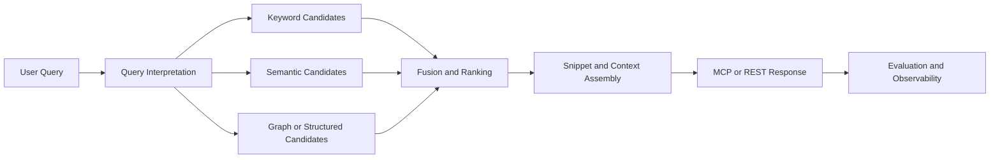

# Retrieval Improvement Plan

## Objective

Improve Axon's retrieval usefulness across API and MCP clients by making search, graph navigation, and architecture-context tools more reliable, better ranked, and easier to chain together in real developer workflows.

## Scope

This plan covers:
- code search
- documentation/config/path retrieval
- symbol and graph-context retrieval
- architecture and system-context retrieval
- retrieval evaluation, ranking, and observability

This plan does not move ownership of indexing production concerns away from the indexing workstream.

## Retrieval Flow

## Current Baseline

`✅` shipped, `🚧` partial, `🛑` missing.

| Area | Status | Notes |
| --- | --- | --- |
| Hybrid symbol search | `✅` | `SearchService` supports keyword + semantic search with reciprocal-rank fusion. |
| Documentation/config/path retrieval | `✅` | Shipped through MCP tool handlers and backing database queries. |
| Symbol context and graph navigation | `✅` | Multiple retrieval tools are already exposed through the MCP router. |
| Architecture-context retrieval | `🚧` | Tool surface exists, but usefulness depends on service mapping, summaries, and relation quality. |
| Query intent routing | `🚧` | Some tools are specialized, but there is no explicit retrieval-layer intent model or evaluation contract. |
| Retrieval evaluation set | `🛑` | No canonical benchmark queries or acceptance thresholds exist. |
| Retrieval observability | `🚧` | Metrics exist for some search/tool paths, but there is no retrieval-quality instrumentation loop yet. |

## Workstream Boundary

`✅` owned here, `🤝` dependency on indexing.

| Concern | Ownership | Notes |
| --- | --- | --- |
| Ranking, fusion, result usefulness, and tool chaining | `✅` | Retrieval-owned behavior and acceptance criteria. |
| Snippet selection and response packaging | `✅` | Retrieval should define how much context is surfaced and in what shape. |
| Corpus freshness, symbols, relations, chunks, embeddings | `🤝` | Produced by indexing; retrieval consumes these artifacts and records quality dependencies. |
| Upstream graph/data quality requests | `🤝` | Retrieval can define explicit contracts and failure cases but should avoid ad hoc indexing refactors. |

## Success Criteria

`🧭` define in Phase 1, then measure continuously.

| Metric | Why it matters | Phase 1 output |
| --- | --- | --- |
| Top-k usefulness on curated developer queries | Primary relevance signal | Seed benchmark set with expected useful outcomes |
| Search-to-context chain success | Measures whether results lead to the next useful tool call | Follow-up scenarios for `search_code -> get_symbol_context` and related flows |
| Architecture query usefulness | Ensures higher-level tools are not just present but actionable | Seed scenarios for project map, module summary, request-flow, and codebase-structure queries |
| Warm-path latency | Keeps retrieval practical in interactive use | Baseline timing targets for representative queries |
| Docs/implementation parity | Prevents drift and false assumptions | Explicit doc audit and canonical references |

## Phased Plan

`✅` completed, `🧭` next, `🚧` partial, `🔥` risk.

| Phase | Status | Focus | Risk |
| --- | --- | --- | --- |
| R1. Retrieval baseline and truth alignment | `🧭` | Inventory shipped retrieval behavior, align docs, define benchmark seed set, and record upstream dependencies. | `🔥` Teams may optimize the wrong layer without a shared baseline. |
| R2. Search ranking and result packaging | `🧭` | Improve query normalization, keyword/semantic fusion, snippet selection, and result ordering. | `🔥` Heuristic changes can regress known workflows without benchmark coverage. |
| R3. Graph and symbol-context retrieval quality | `🧭` | Improve `get_symbol_context`, usages/references, call navigation, and search-to-graph transitions. | `🔥` Quality depends on upstream relation fidelity, especially for Java. |
| R4. Architecture-context retrieval quality | `🧭` | Improve project/module/system/request-flow retrieval usefulness and clarify when these tools should be used. | `🔥` Architecture tools can look broad but fail on sparse service or relation data. |
| R5. Retrieval observability and regression discipline | `🧭` | Add usefulness/latency regressions, benchmark reporting, and retrieval-facing metrics. | `🔥` Retrieval quality work drifts quickly without recurring evidence. |

## Recommended Execution Slices

`🧭` recommended next slices in dependency order.

| Slice | Status | Why first |
| --- | --- | --- |
| R1A. Retrieval surface audit and doc alignment | `🧭` | Prevents planning against stale or incomplete assumptions. |
| R1B. Curated query set and expected outcomes | `🧭` | Creates the first real quality gate. |
| R2A. Search query normalization and tokenization review | `🧭` | Cheap improvement path with immediate retrieval impact. |
| R2B. Fusion, boosts, and snippet selection tuning | `🧭` | Directly affects top-result usefulness in MCP and REST. |
| R3A. Search-to-symbol-context contract | `🧭` | Makes existing search results more actionable. |
| R4A. Architecture tool validation on representative repos | `🧭` | Distinguishes shipped tool surface from actually useful retrieval. |
| R5A. Retrieval benchmark harness/reporting | `🧭` | Keeps future tuning changes evidence-based. |

## First Slice Contract: R1 Retrieval Baseline And Truth Alignment

This is the current recommended starting slice.

### Deliverables

1. Canonical retrieval handover and startup path.
2. Canonical retrieval improvement plan.
3. Audit of active retrieval tool surface versus docs.
4. Seed query set covering:
   - direct symbol lookup
   - natural-language code intent
   - documentation/config lookup
   - path/module lookup
   - symbol-context follow-up
   - architecture/request-flow questions
5. Explicit list of upstream indexing dependencies affecting retrieval quality.

### Acceptance

1. A new contributor can identify the retrieval workstream and its startup docs from `AGENTS.md`.
2. There is one canonical plan doc for retrieval increments.
3. Retrieval docs describe the actual implemented surface, not just aspirations.
4. At least one benchmark seed exists for each major retrieval mode.

## Upstream Dependencies To Track Explicitly

`🚧` known dependencies that can block retrieval quality.

| Dependency | Current state | Retrieval impact |
| --- | --- | --- |
| Java import/call/dependency relation precision | `🚧` | Weakens graph navigation, request flow, and context tools. |
| Architecture/service summaries | `🚧` | Limits usefulness of higher-level architecture retrieval. |
| Docs/config extraction consistency | `🚧` | Makes documentation and configuration retrieval uneven across repos. |
| Repository/file-count semantics | `🚧` | Can distort repository-level heuristics and summaries if used carelessly. |

## Retrieval Rules Of Thumb

1. Do not treat more tool breadth as progress if result usefulness is still unmeasured.
2. Prefer deterministic retrieval improvements before adding LLM-heavy behavior.
3. Record every upstream indexing dependency as an explicit contract with examples.
4. Keep benchmark evidence close to the retrieval change that motivated it.
