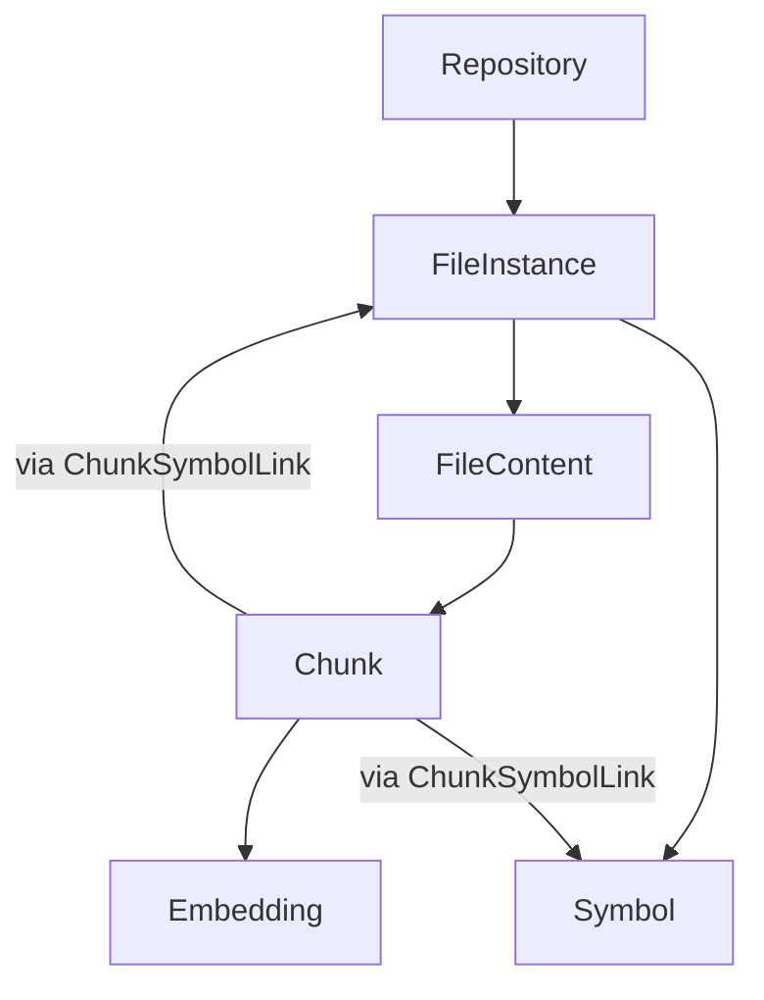

# Retrieval Workstream Alignment Note

## Purpose

This note is for the parallel retrieval / semantic-search workstream.

It explains how to continue retrieval improvements without conflicting with the
file instance / file content separation work on branch
`file-instance-content-separation`.

## Snapshot

- Date: 2026-03-18
- Audience: parallel retrieval / semantic-search implementers
- Status: `🧭` active coordination note

## Current Architectural Reality

`✅` stable enough to build against, `🚧` transitional, `🛑` avoid depending on it.

| Area | Status | Practical meaning |
| --- | --- | --- |
| `FileInstance` vs `FileContent` split | `✅` | File lifecycle and content identity are now separate and should be treated as the baseline model. |
| Active-only lifecycle filtering for user-facing reads | `✅` | Retrieval/search/navigation code should assume `MISSING` file instances must be excluded unless a path is explicitly lifecycle-aware. |
| Parse/embed orchestration via `changed_content_ids` | `✅` | New incremental semantic work should prefer content IDs, not changed chunk IDs, as the update signal. |
| `Chunk.file_instance_id` | `✅` | Removed from the ORM/runtime baseline; symbol/file context now comes from `ChunkSymbolLink`. |
| `Chunk.symbol_id` | `✅` | Removed from the ORM/runtime baseline; do not reintroduce direct chunk-to-symbol ownership. |
| `Embedding.symbol_id` | `✅` | Removed from the ORM/runtime baseline; embeddings are chunk-owned only. |
| True many-instance shared chunks | `🚧` | Association-backed shape is landed in code; remaining work is validation/cleanup, not core schema direction. |

## Mental Model To Use

Use this as the working model for new retrieval work:

Interpretation:

1. `FileInstance` owns path, repository, lifecycle state, and run tracking.
2. `FileContent` owns reusable content identity.
3. `Symbol` is instance-scoped.
4. `Chunk` should be treated as content-derived only.
5. `Embedding` should be treated as chunk-derived, not file-derived.

## Compatibility Assessment

`✅` safe to proceed, `🚧` proceed with guardrails, `🛑` likely conflict.

| Parallel work item | Status | Why |
| --- | --- | --- |
| Retrieval benchmark/query-set work | `✅` | Does not depend on storage ownership details. |
| Evaluation workflow / regression reporting | `✅` | Orthogonal to instance/content ownership. |
| Query normalization and ranking heuristics | `✅` | Mostly retrieval-layer logic. |
| Activating `query_text` reranking in semantic search | `✅` | Safe if it does not add new persistence coupling. |
| Import/context population in chunk text | `✅` | Improves corpus quality without changing ownership assumptions. |
| Implementation body inclusion in chunk text | `✅` | Safe if implemented as better chunk content, not new symbol/file ownership coupling. |
| Snippet-selection improvements | `✅` | Safe when phrased as "best associated chunk" and implemented through chunk links. |
| New incremental semantic-refresh logic | `🚧` | Must use `changed_content_ids`, not `changed_chunk_ids`, as the durable update signal. |
| New persistence/query logic built around `Chunk.file_instance_id` | `🛑` | Conflicts with planned removal of chunk-to-instance dependency. |
| New persistence/query logic built around `Chunk.symbol_id` as permanent architecture | `🛑` | Conflicts with planned association-table cut for true shared chunks. |
| Schema changes that strengthen chunk/symbol/file coupling | `🛑` | Direct conflict with final chunk-sharing direction. |

## Required Guardrails

### Safe assumptions

1. A result should belong to an active file instance, not a `MISSING` one.
2. Content identity is now the durable reuse boundary.
3. Incremental embedding refresh should be thought of as content-driven.

### Unsafe assumptions

1. "One chunk belongs to exactly one symbol."
2. "One chunk belongs to exactly one file instance."
3. "Changed chunk IDs are the canonical incremental contract."
4. "Embedding rows should permanently carry symbol ownership."

## Safe Implementation Pattern

When improving retrieval behavior, prefer these contracts:

| Need | Recommended phrasing |
| --- | --- |
| Snippet selection | "best matching chunk associated with the result symbol" |
| Incremental semantic refresh | "content IDs changed, then resolve chunks from content" |
| Retrieval ranking dependencies | "consume chunks/embeddings as upstream artifacts" |
| Search-result explanation | "this chunk matched this symbol/context" |

Avoid these contracts:

| Need | Avoid phrasing |
| --- | --- |
| Snippet selection | "the chunk owned by the symbol" |
| Incremental refresh | "the changed chunk IDs are the source of truth" |
| Storage model | "chunks are stored against symbols and files" |

## Files To Treat As Transitional

Be careful when editing these files because their current behavior will likely
change again when shared-chunk schema work lands:

- `/workspaces/axon-mcp/axon-src/src/api/services/search_service.py`
- `/workspaces/axon-mcp/axon-src/src/mcp_server/tools/symbols.py`
- `/workspaces/axon-mcp/axon-src/src/utils/call_graph_traversal.py`
- `/workspaces/axon-mcp/axon-src/src/vector_store/pgvector_store.py`
- `/workspaces/axon-mcp/axon-src/src/extractors/knowledge_extractor.py`

## Recommended Boundaries For Parallel Work

### Proceed now

1. Benchmark seed docs and evaluation workflow.
2. Query normalization and fusion tuning.
3. `query_text` semantic reranking activation.
4. Import/context population in chunk text.
5. Implementation body inclusion in chunk text.
6. Snippet selection improvements that do not assume permanent `Chunk.symbol_id`
   ownership.

### Coordinate before coding

1. Any change that reintroduces direct chunk-to-symbol ownership.
2. Any change that reintroduces direct chunk-to-file-instance ownership.
3. Any change that adds symbol ownership back to embeddings.
4. Any schema change involving chunks, embeddings, or symbol/chunk joins.

## Concrete Doc Drift To Keep In Mind

The current semantic-search plan still contains language that is no longer a safe
architectural assumption:

- "Symbol-linked chunk storage"
- "Chunks and embeddings are stored against symbols and files"
- "Embedding generation still works incrementally on changed chunks"

Treat those as transitional wording, not durable architecture.

## If You Need A Stable Short-Term Contract

Use this:

1. Retrieval may read chunks and embeddings as indexed artifacts.
2. Retrieval must not introduce new hard dependencies on chunk-to-symbol or
   chunk-to-file ownership.
3. New incremental semantic features should accept content-driven invalidation.
4. Lifecycle-safe filtering is required for user-facing retrieval paths.

## Escalation Rule

If a retrieval improvement requires answering either of these questions, stop and
coordinate with the indexing/content-separation workstream before coding:

1. "Does this feature require `Chunk.symbol_id` to remain permanent?"
2. "Does this feature require `Chunk.file_instance_id` to remain permanent?"

If the answer is yes, it is no longer a retrieval-only change.
