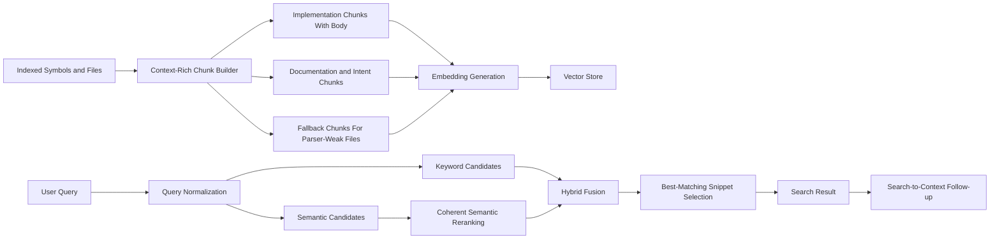

# Semantic Search Improvement Plan

## Objective

Improve Axon's semantic-search usefulness by raising the quality of indexed chunk content, simplifying semantic ranking behavior, and adding benchmark-driven tuning before threshold changes.

This plan sits under the broader retrieval workstream and focuses specifically on the `search_code` semantic path.

## Why This Plan Exists

Recent comparison against KiloCode's `code-index` structure shows a clear pattern:

- Axon already has the stronger retrieval architecture overall
- Axon is weaker in semantic-search corpus discipline
- the next improvement should target chunk quality and evaluation before more ranking heuristics

Reference analysis:

- `/workspaces/axon-mcp/docs/kilocode-semantic-search-analysis.md`

## Current Baseline

`✅` shipped, `🚧` partial, `🛑` gap.

| Area | Status | Current reality |
| --- | --- | --- |
| Hybrid keyword + semantic search | `✅` | `SearchService` fuses keyword and semantic candidates with reciprocal-rank fusion. |
| Symbol-linked chunk storage | `✅` | Chunks and embeddings are stored against symbols and files. |
| Incremental embedding reuse | `✅` | Existing chunk embeddings are skipped or reused by hash. |
| Vector ANN index on `embeddings.vector` | `✅` | `embeddings.vector` now targets a fixed `vector(1024)` contract for `mxbai-embed-large`, with a direct HNSW index. |
| Host Ollama integration for local dev | `✅` | Dev-container runtime now targets host Ollama at `host.docker.internal:11434/v1`, and the `mxbai-embed-large` smoke test passes. |
| Live corpus rebuilt on `1024` embeddings | `✅` | The local DB corpus has been reset and rebuilt with `mxbai-embed-large`, restoring 11,710 embeddings on the fixed contract. |
| Implementation chunk body inclusion | `🚧` | Chunker supports body extraction, but current ingestion passes `file_content=None`, so body text is often omitted from implementation chunks. |
| Import/context population | `🛑` | `ChunkContextBuilder._extract_imports()` currently returns an empty list. |
| Semantic snippet selection | `🚧` | Search previews return the first chunk per symbol, not the best matching chunk. |
| Semantic reranking contract | `🚧` | `PgVectorStore.search_similar()` supports `query_text` boosting, but the main search path does not use it. |
| Benchmark-driven threshold tuning | `🛑` | There is no canonical semantic-search query set or acceptance contract yet. |

## Root Problems

| Problem | Why it hurts usefulness | Current source |
| --- | --- | --- |
| Operational model-change contract is still thin | The fixed-size runtime path works, but we still need a clear runbook for changing embedding model or dimension in the future | `/workspaces/axon-mcp/axon-src/src/vector_store/pgvector_store.py`, `/workspaces/axon-mcp/axon-src/docs/validation/semantic_search_index_validation_20260318.md` |
| Implementation chunks often omit code bodies | Embeddings miss the strongest semantic signal in the symbol | `/workspaces/axon-mcp/axon-src/src/extractors/knowledge_extractor.py` |
| Imports are not populated | Queries about framework usage, dependencies, or external types lose context | `/workspaces/axon-mcp/axon-src/src/embeddings/chunk_context.py` |
| First-chunk preview selection is naive | Returned snippets are often worse than the actual matched chunk | `/workspaces/axon-mcp/axon-src/src/api/services/search_service.py` |
| Vector reranking logic is split | Search behavior is harder to reason about and partially dead | `/workspaces/axon-mcp/axon-src/src/vector_store/pgvector_store.py`, `/workspaces/axon-mcp/axon-src/src/api/services/search_service.py` |
| Fixed permissive threshold is untuned | Recall/precision tradeoffs are being guessed instead of measured | `/workspaces/axon-mcp/axon-src/src/api/services/search_service.py` |
| No semantic benchmark set | Ranking changes can easily regress known workflows | Retrieval docs and tests baseline |

## Target Design

## Principles

1. Improve corpus quality before threshold tuning.
2. Prefer one coherent semantic-ranking path over partially overlapping logic.
3. Keep Axon's hybrid + graph-native advantage.
4. Add benchmark evidence before changing recall/precision knobs.
5. Make search results easier to chain into symbol and graph tools.

## Phased Plan

`🧭` next, `🚧` partial, `🔥` risk.

| Phase | Status | Focus | Risk |
| --- | --- | --- | --- |
| S0. Semantic-search DB indexing baseline | `🚧` | Fixed-size ANN indexing now targets `mxbai-embed-large` at `1024`, host-Ollama access is working, and the local corpus has been rebuilt; the remaining S0 work is planner/latency rerun plus the operator runbook. | `🔥` The main remaining S0 risk is documentation drift around rebuild/runbook behavior, not implementation readiness. |
| S1. Benchmark baseline and semantic-search contract | `🧭` | Create seed queries, expected outcomes, and evaluation workflow before tuning. | `🔥` Tuning without a benchmark will create churn and regressions. |
| S2. Chunk corpus quality | `🧭` | Add symbol body text, imports, and explicit fallback-chunking policy. | `🔥` Larger chunks can shift embedding behavior and storage costs. |
| S3. Semantic-ranking cleanup | `🧭` | Use one coherent semantic reranking contract and remove dead paths. | `🔥` Ranking changes can destabilize existing search behavior. |
| S4. Snippet and result packaging | `🧭` | Return the best matching chunk and tighten search-to-context affordances. | `🔥` Better ranking can still feel weak if snippet selection stays naive. |
| S5. Threshold tuning and graph-aware follow-ups | `🧭` | Tune thresholds using benchmarks and add higher-order reranking only after baseline quality improves. | `🔥` Graph-aware boosting will magnify upstream relation-quality weaknesses. |

## Detailed Execution Slices

### S0A. Create The Default pgvector Index Contract

Make ANN indexing of `embeddings.vector` a first-class runtime contract instead of an optional helper method.

Current implementation status:

- `✅` Alembic migration now converts `embeddings.vector` to `vector(1024)`, enforces `dimension = 1024`, and creates `embeddings_vector_idx`
- `✅` API startup ensures the fixed HNSW index exists at runtime
- `✅` embedding generation now fails fast if the configured model dimension is not `1024`
- `✅` semantic search now uses the fixed-size vector column directly with a KNN candidate query shape that can use pgvector ANN indexes
- `✅` Local dev runtime is wired to host Ollama and `scripts/test_mxbai_embed_large.py` passes against `mxbai-embed-large`
- `✅` The old `768` corpus has been deleted and rebuilt on the fixed `1024` contract
- `🚧` The previous live planner validation was captured on the old `768` corpus; the `1024` contract still needs a fresh planner/latency rerun on the rebuilt corpus
- `🚧` Rebuild/upgrade behavior is still not captured in an operational runbook

This slice should decide and document:

- the fixed embedding contract itself, not just the index type
- preferred index type: `hnsw` or `ivfflat`
- where index creation happens: migration, startup hook, admin command, or validation task
- rebuild expectations after dimension/model changes
- minimum table-size conditions if `ivfflat` is chosen

Recommended default:

- prefer `hnsw` first for operational simplicity and better small-to-medium corpus behavior
- keep `ivfflat` available only as an explicitly chosen alternative
- use a fixed `vector(1024)` contract for the current `mxbai-embed-large` semantic-search baseline

Acceptance:

1. A repository can be brought to a state where semantic search uses a real pgvector ANN index by default.
2. The chosen fixed-dimension and index strategy is documented in one canonical place.
3. Model/dimension changes have an explicit rebuild contract.

Implementation note:

- Current default: `hnsw`
- Creation path: migration-backed baseline plus startup enforcement
- Existing non-HNSW ANN index: detected and logged as a mismatch rather than silently replaced
- Chosen fix: lock `embeddings.vector` to `vector(1024)`, enforce `dimension = 1024`, and use a direct raw-column HNSW index
- Validation artifact: `/workspaces/axon-mcp/axon-src/docs/validation/semantic_search_index_validation_20260318.md`

### S0B. Validate Planner And Latency Behavior

After creating the fixed-size ANN-index contract, validate that semantic search is actually using it in practice.

This slice should capture:

- representative query timings before and after index creation
- `EXPLAIN`-style validation that planner behavior is sane
- warm-path latency notes for a small and medium corpus

Acceptance:

1. We have evidence that semantic search is not relying on an accidental full scan baseline.
2. Latency measurements are recorded before semantic ranking work starts.

Current validation artifact:

- `/workspaces/axon-mcp/axon-src/docs/validation/semantic_search_index_validation_20260318.md`

### S1A. Semantic Search Benchmark Seed Set

Create a benchmark seed set that covers:

- exact identifier lookup
- natural-language intent lookup
- framework usage lookup
- import/dependency lookup
- documentation-backed semantic lookup
- ambiguous multi-result queries
- search-to-symbol-context follow-ups

Planned artifact:

- `docs/validation/semantic_search_benchmark_seed.md`

Acceptance:

1. At least 20 seed queries across the categories above.
2. Each query records repository scope, expected useful result type, and top-k acceptance notes.
3. At least 5 queries explicitly test Java retrieval quality.

### S1B. Evaluation Harness Plan

Add a repeatable workflow for measuring:

- top-1 usefulness
- top-3 usefulness
- noisy-result rate
- search-to-context chain success
- warm-path latency

Planned artifact:

- `docs/validation/semantic_search_evaluation_workflow.md`

Acceptance:

1. Every semantic-search tuning change can be checked against the same query set.
2. Result review format is deterministic enough to compare before/after changes.

### S2A. Improve Implementation Chunk Content

Change ingestion so implementation chunks include actual symbol body text when available.

This means:

- read file content in the extractor path where chunks are built
- pass file content into `SymbolChunker.create_chunks_for_symbol(...)`
- keep size guards so chunk bodies do not explode uncontrollably

Why first:

- chunk text quality is the main semantic-search input
- ranking work on weak chunks is low leverage

Acceptance:

1. Implementation chunks include signature plus body text for normal symbols.
2. Existing fallback behavior remains safe for missing/unreadable file content.
3. Embedding generation still works incrementally on changed chunks only.

### S2B. Populate Imports and File-Level Context

Implement actual import extraction for chunk context rather than returning `[]`.

This should populate:

- top imports or package references
- module/package namespace where available
- a bounded list only, to avoid bloating chunks

Why this matters:

- semantic search often depends on framework and dependency context
- many code queries are really asking "where is X used with Y framework/type/library"

Acceptance:

1. `ChunkContext.imports` is populated for supported languages where imports are available.
2. Chunk content and metadata include bounded import context.
3. Java and Python are first priority.

### S2C. Add Explicit Fallback Chunking Policy

Introduce a centralized policy for parser-weak file types and parser-empty cases.

Borrow from KiloCode:

- explicit registry of fallback-targeted file types
- line/length-based chunking as a deliberate fallback, not accidental behavior

Acceptance:

1. A single canonical fallback policy exists.
2. Parser-weak files still produce usable semantic chunks.
3. Docs/config formats can opt into specialized fallback policies where needed.

### S3A. Unify Semantic Reranking Logic

Pick one of these options and implement it fully:

| Option | Recommendation | Reason |
| --- | --- | --- |
| Pass `query_text` into `PgVectorStore.search_similar()` and let vector search handle semantic-side textual boosts | `✅` first step | Smallest change, makes existing code path coherent |
| Remove `query_text` from `PgVectorStore.search_similar()` and keep all fusion/boost logic in `SearchService` | `🧭` possible later simplification | Cleaner layering, but a larger refactor |

Recommended sequence:

1. First pass `query_text` so the existing reranking path is live.
2. Then decide whether to keep that layering or centralize it later.

Acceptance:

1. There is no dead semantic reranking path.
2. The semantic-search scoring path is documented and testable.
3. Before/after benchmark output is recorded.

### S3B. Review Threshold Contract

Do not tune thresholds before S1 and S2 are complete.

After the benchmark exists:

- test the current fixed `0.5` threshold
- compare against tighter thresholds by query category
- decide whether the threshold should be global or query-type-specific

Acceptance:

1. Threshold changes are justified by benchmark evidence.
2. The chosen threshold minimizes obvious noise without hurting known useful queries.

### S4A. Best-Matching Snippet Selection

Replace "first chunk per symbol" preview logic with "best matching chunk per returned symbol."

Preferred order:

1. exact matched semantic chunk if available
2. best-scoring chunk for that symbol
3. fallback to first chunk only if nothing else is available

Acceptance:

1. Search previews better reflect why the result matched.
2. Semantic queries show the relevant block rather than arbitrary leading content.

### S4B. Search-to-Context Contract

Improve result packaging so top results are easier to chain into:

- `get_symbol_context`
- `find_usages`
- `get_call_hierarchy`

Acceptance:

1. Search results consistently expose symbol identity and next-step affordances.
2. Benchmark scenarios include `search_code -> get_symbol_context`.

### S5A. Graph-Aware Semantic Improvements

Only after S1-S4:

- consider relation-aware boosts
- consider architecture/service-aware boosts
- keep these as additive improvements, not replacements for chunk quality

## Benchmark Plan

### Query Categories

| Category | Example shape | Primary acceptance |
| --- | --- | --- |
| Exact identifier | `SearchService` | Exact symbol appears in top 3 |
| Natural-language intent | `find authentication middleware` | A semantically relevant implementation appears in top 3 |
| Framework usage | `where do we define FastAPI routes` | Route/controller/endpoints appear in top 5 |
| Import/dependency context | `uses pgvector` | Relevant symbols/files appear in top 5 |
| Docs-backed | `how to configure redis` | Config/docs symbols appear in top 5 |
| Java semantics | `where is dependency injection configured` | Useful Java results appear in top 5 |
| Search-to-context | `find request flow entrypoint` | At least one result clearly chains into context tools |

### Evaluation Method

For each query record:

- query text
- repository scope
- query category
- expected useful result shape
- top-1 useful: yes/no
- top-3 useful: yes/no
- noise notes
- follow-up tool success

### Recommended Initial Corpus

Use a small but varied set:

- one Python-heavy repository
- one Java-heavy repository
- one mixed docs/config-heavy repository

## Open Questions To Resolve During Implementation

1. Should chunk bodies be stored in full for all symbol kinds or only selected kinds?
2. Should import context come from parser output, file-level extraction, or relation reconstruction?
3. Should semantic snippets be symbol-level or chunk-level in the API schema?
4. Should threshold selection remain global or become language/query-aware?

## Immediate Next Actions

1. Rerun live planner validation under the rebuilt `1024` corpus and record the new latency evidence.
2. Create the benchmark seed document so ranking changes stop being heuristic-only.
3. Implement implementation-chunk body inclusion in ingestion.
4. Implement import/context population for Python and Java first.
5. Activate the existing `query_text` semantic reranking path.
6. Replace first-chunk snippet selection with best-match snippet selection.

## Highlighted Next Steps

Recommended execution order from here:

1. `S0B`: rerun `EXPLAIN`/latency validation on the rebuilt `mxbai-embed-large` corpus.
2. `S1A` and `S1B`: write the benchmark seed and evaluation workflow docs.
3. `S2A`: improve chunk content by passing real file bodies into chunk construction.
4. `S2B`: populate imports/file-level context for Python and Java.
5. `S3A`: turn on the existing `query_text` semantic reranking path.
6. `S4A`: return the best matching chunk snippet instead of the first chunk.

## Explicit Answers To Current Questions

### Does "improve chunk content first" mean changing ingestion?

Yes.

It means changing the indexing/ingestion path so the text that gets embedded is better.
The most important example is passing real file content into chunk construction so implementation chunks include actual symbol bodies instead of mostly metadata and signatures.

### What does "populate import/context features properly" mean?

It means filling in context fields that the chunk model already expects but the current implementation does not actually provide.

Today, `ChunkContextBuilder._extract_imports()` returns an empty list.
So the chunk schema has room for imports, but the ingestion path is not populating them yet.

In simple terms:

- the design expects chunks to say "this symbol lives with these imports/framework references"
- the current implementation stores "none"

That matters because many semantic queries depend on those framework/type/package hints.
