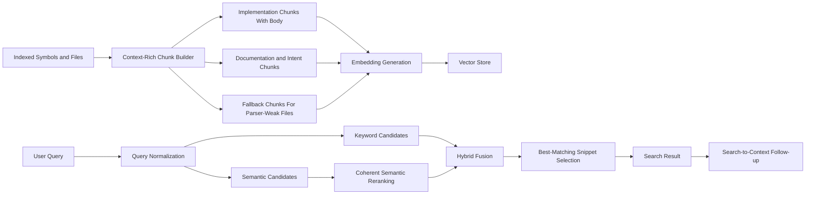

# Semantic Search Improvement Plan

## Objective

Improve Axon's semantic-search usefulness by raising the quality of indexed chunk content, simplifying semantic ranking behavior, and adding benchmark-driven tuning before threshold changes.

This plan sits under the broader retrieval workstream and focuses specifically on the `search_code` semantic path.

## Why This Plan Exists

Recent comparison against KiloCode's `code-index` structure shows a clear pattern:

- Axon already has the stronger retrieval architecture overall
- Axon is weaker in semantic-search corpus discipline
- the next improvement should target chunk quality and evaluation before more ranking heuristics

Reference analysis:

- `/workspaces/axon-mcp/docs/kilocode-semantic-search-analysis.md`

## Current Baseline

`✅` shipped, `🚧` partial, `🛑` gap.

| Area | Status | Current reality |
| --- | --- | --- |
| Hybrid keyword + semantic search | `✅` | `SearchService` fuses keyword and semantic candidates with reciprocal-rank fusion. |
| Transitional chunk/symbol/file linkage | `🚧` | Retrieval currently reads chunks and embeddings through legacy symbol/file links, but new work should treat chunks as content-derived artifacts and avoid deepening ownership assumptions. |
| Incremental embedding reuse | `✅` | Existing chunk embeddings are skipped or reused by hash, but new semantic-refresh work should follow `changed_content_ids` as the durable invalidation contract. |
| Vector ANN index on `embeddings.vector` | `✅` | `embeddings.vector` now targets a fixed `vector(1024)` contract for `mxbai-embed-large`, with a direct HNSW index. |
| Host Ollama integration for local dev | `✅` | Dev-container runtime now targets host Ollama at `host.docker.internal:11434/v1`, and the `mxbai-embed-large` smoke test passes. |
| Live corpus rebuilt on `1024` embeddings | `✅` | The local DB corpus has been refreshed into the active lifecycle model with `7,036` embeddings on the fixed contract. |
| Embedding request resilience for context-rich chunks | `✅` | OpenAI-compatible embedding generation now splits context-limit batches and retries singleton overflows with bounded truncation instead of dropping the whole batch. |
| Implementation chunk body inclusion | `✅` | Extractor path now loads source text once per parsed file and passes it into chunk construction when the source file is readable. |
| Import/context population | `🚧` | Parser-backed import extraction now populates bounded Python/Java chunk context when source text is available, but broader language coverage and refreshed corpus materialization are still pending. |
| Explicit fallback chunking policy | `🚧` | Parser-empty config/build/dependency files now create bounded file-level fallback chunks and explicit file-backed module symbols during extraction, but the live corpus still needs refreshes to pick them up broadly. |
| Semantic snippet selection | `🚧` | Search previews now prefer the best semantic or text-matching chunk per symbol, and results expose snippet provenance plus suggested follow-up tools, but context chaining is still not fully benchmarked across the whole seed set. |
| Semantic reranking contract | `🚧` | The main search path now forwards `query_text` into `PgVectorStore.search_similar()`, real SQLAlchemy row-shape failures are fixed, and hybrid ranking is live on the rebuilt corpus, but the layered scoring contract still needs broader benchmark review. |
| Config/dependency retrieval weighting | `🚧` | Config/framework/API/UI/background/member-flow intent boosts now materially improve retrieval for `database configuration`, `uses mongo`, `find Jameica GUI views`, and member CSV-import queries; remaining work is mostly chainability validation and broader corpus coverage. |
| Benchmark-driven threshold tuning | `🚧` | Canonical seed queries and evaluation workflow now exist on an active corpus, the full live non-`axon-src` seed run is recorded, and sampled search-to-context follow-ups now succeed on the strongest updated queries; threshold decisions and repeated before/after comparisons are still pending. |

## Root Problems

| Problem | Why it hurts usefulness | Current source |
| --- | --- | --- |
| The benchmark baseline is now live but still incomplete for threshold decisions | The full live non-`axon-src` seed is now recorded, but `axon-src` is still out of corpus scope for this local DB and follow-up chainability checks were not rerun across the whole set | `/workspaces/axon-mcp/axon-src/docs/validation/semantic_search_benchmark_seed.md`, `/workspaces/axon-mcp/axon-src/docs/validation/semantic_search_evaluation_workflow.md`, `/workspaces/axon-mcp/axon-src/docs/validation/semantic_search_benchmark_20260318.md` |
| Import/context coverage is still partial | Python/Java now populate parser-backed imports, but broader language coverage and existing-corpus refreshes are still needed for consistent framework/dependency context | `/workspaces/axon-mcp/axon-src/src/embeddings/chunk_context.py` |
| Snippet/result packaging is still only partially improved | Better chunk choice, match provenance, and next-step tool hints are live, but full search-to-context evaluation is still thin | `/workspaces/axon-mcp/axon-src/src/api/services/search_service.py` |
| Vector reranking logic is still layered across two components | The query-text path is live now, but the end-state scoring contract is still harder to reason about than it should be | `/workspaces/axon-mcp/axon-src/src/vector_store/pgvector_store.py`, `/workspaces/axon-mcp/axon-src/src/api/services/search_service.py` |
| Fixed permissive threshold is untuned | Recall/precision tradeoffs are being guessed instead of measured | `/workspaces/axon-mcp/axon-src/src/api/services/search_service.py` |
| Benchmark execution is not yet recurring | The first live subset run is recorded, but repeated full-seed before/after comparisons are still missing | `/workspaces/axon-mcp/axon-src/docs/validation/semantic_search_benchmark_seed.md`, `/workspaces/axon-mcp/axon-src/docs/validation/semantic_search_evaluation_workflow.md`, `/workspaces/axon-mcp/axon-src/docs/validation/semantic_search_benchmark_20260318.md` |

## Target Design

## Principles

1. Improve corpus quality before threshold tuning.
2. Prefer one coherent semantic-ranking path over partially overlapping logic.
3. Keep Axon's hybrid + graph-native advantage.
4. Add benchmark evidence before changing recall/precision knobs.
5. Make search results easier to chain into symbol and graph tools.

## Phased Plan

`🧭` next, `🚧` partial, `🔥` risk.

| Phase | Status | Focus | Risk |
| --- | --- | --- | --- |
| S0. Semantic-search DB indexing baseline | `✅` | Fixed-size ANN indexing, live planner/latency validation on the `1024` corpus, and the operator rebuild/runbook contract are now documented. | `🔥` The remaining environment risk is a lifecycle-model mismatch in the current local corpus snapshot, not the ANN baseline itself. |
| S1. Benchmark baseline and semantic-search contract | `✅` | Canonical seed queries, expected outcome categories, and a repeatable evaluation workflow are now in place before ranking/threshold tuning. | `🔥` The benchmark contract now exists, but skipped or inconsistent corpus refreshes can still make comparisons misleading. |
| S2. Chunk corpus quality | `🚧` | Implementation-chunk body inclusion, embedding-safe handling, and parser-empty fallback chunking are now wired through ingestion; remaining work is broader import/context coverage plus corpus refreshes that materialize the new fallback policy broadly. | `🔥` Larger or more context-rich chunks can shift embedding behavior, storage costs, and result balance if introduced without benchmark coverage. |
| S3. Semantic-ranking cleanup | `🚧` | Live row-shape fixes, chunk-aware keyword candidates, light query normalization, corpus-specific intent boosts, and precision-first hybrid weighting for member CSV-import queries are now in place; remaining work is repeated benchmark and chainability validation. | `🔥` Ranking changes can destabilize existing search behavior. |
| S4. Snippet and result packaging | `🚧` | Return the best matching chunk, expose match provenance, and tighten search-to-context affordances. | `🔥` Better ranking can still feel weak if snippet selection stays naive. |
| S5. Threshold tuning and graph-aware follow-ups | `🧭` | Tune thresholds using benchmarks and add higher-order reranking only after baseline quality improves. | `🔥` Graph-aware boosting will magnify upstream relation-quality weaknesses. |

## Detailed Execution Slices

### S0A. Create The Default pgvector Index Contract

Make ANN indexing of `embeddings.vector` a first-class runtime contract instead of an optional helper method.

Current implementation status:

- `✅` Alembic migration now converts `embeddings.vector` to `vector(1024)`, enforces `dimension = 1024`, and creates `embeddings_vector_idx`
- `✅` API startup ensures the fixed HNSW index exists at runtime
- `✅` embedding generation now fails fast if the configured model dimension is not `1024`
- `✅` semantic search now uses the fixed-size vector column directly with a KNN candidate query shape that can use pgvector ANN indexes
- `✅` Local dev runtime is wired to host Ollama and `scripts/test_mxbai_embed_large.py` passes against `mxbai-embed-large`
- `✅` The old `768` corpus has been deleted and rebuilt on the fixed `1024` contract
- `✅` Live planner/latency validation has been rerun against the rebuilt `1024` corpus
- `✅` Rebuild/upgrade behavior is now captured in an operator runbook

This slice should decide and document:

- the fixed embedding contract itself, not just the index type
- preferred index type: `hnsw` or `ivfflat`
- where index creation happens: migration, startup hook, admin command, or validation task
- rebuild expectations after dimension/model changes
- minimum table-size conditions if `ivfflat` is chosen

Recommended default:

- prefer `hnsw` first for operational simplicity and better small-to-medium corpus behavior
- keep `ivfflat` available only as an explicitly chosen alternative
- use a fixed `vector(1024)` contract for the current `mxbai-embed-large` semantic-search baseline

Acceptance:

1. A repository can be brought to a state where semantic search uses a real pgvector ANN index by default.
2. The chosen fixed-dimension and index strategy is documented in one canonical place.
3. Model/dimension changes have an explicit rebuild contract.

Implementation note:

- Current default: `hnsw`
- Creation path: migration-backed baseline plus startup enforcement
- Existing non-HNSW ANN index: detected and logged as a mismatch rather than silently replaced
- Chosen fix: lock `embeddings.vector` to `vector(1024)`, enforce `dimension = 1024`, and use a direct raw-column HNSW index
- Validation artifact: `/workspaces/axon-mcp/axon-src/docs/validation/semantic_search_index_validation_20260318.md`

### S0B. Validate Planner And Latency Behavior

After creating the fixed-size ANN-index contract, validate that semantic search is actually using it in practice.

This slice should capture:

- representative query timings before and after index creation
- `EXPLAIN`-style validation that planner behavior is sane
- warm-path latency notes for a small and medium corpus

Acceptance:

1. We have evidence that semantic search is not relying on an accidental full scan baseline.
2. Latency measurements are recorded before semantic ranking work starts.

Current validation artifact:

- `/workspaces/axon-mcp/axon-src/docs/validation/semantic_search_index_validation_20260318.md`
- `/workspaces/axon-mcp/axon-src/docs/guides/semantic_search_embedding_runbook.md`

### S1A. Semantic Search Benchmark Seed Set

Create a benchmark seed set that covers:

- exact identifier lookup
- natural-language intent lookup
- framework usage lookup
- import/dependency lookup
- documentation-backed semantic lookup
- ambiguous multi-result queries
- search-to-symbol-context follow-ups

Planned artifact:

- `docs/validation/semantic_search_benchmark_seed.md`

Current status:

- `✅` Canonical seed set added at `docs/validation/semantic_search_benchmark_seed.md`

Acceptance:

1. At least 20 seed queries across the categories above.
2. Each query records repository scope, expected useful result type, and top-k acceptance notes.
3. At least 5 queries explicitly test Java retrieval quality.

### S1B. Evaluation Harness Plan

Add a repeatable workflow for measuring:

- top-1 usefulness
- top-3 usefulness
- noisy-result rate
- search-to-context chain success
- warm-path latency

Planned artifact:

- `docs/validation/semantic_search_evaluation_workflow.md`

Current status:

- `✅` Evaluation workflow added at `docs/validation/semantic_search_evaluation_workflow.md`

Acceptance:

1. Every semantic-search tuning change can be checked against the same query set.
2. Result review format is deterministic enough to compare before/after changes.

### S2A. Improve Implementation Chunk Content

Change ingestion so implementation chunks include actual symbol body text when available.

This means:

- read file content in the extractor path where chunks are built
- pass file content into `SymbolChunker.create_chunks_for_symbol(...)`
- keep size guards so chunk bodies do not explode uncontrollably
- keep the implementation retrieval-only: improve chunk text without adding new persistence coupling to `Chunk.symbol_id` or `Chunk.file_instance_id`

Current increment status:

- `✅` implemented on 2026-03-18
- extractor path now loads file text once per parsed file and passes it into chunk construction when the on-disk file is readable
- fallback behavior remains unchanged when the file path is missing, relative-only, or unreadable

Why first:

- chunk text quality is the main semantic-search input
- ranking work on weak chunks is low leverage

Acceptance:

1. Implementation chunks include signature plus body text for normal symbols.
2. Existing fallback behavior remains safe for missing/unreadable file content.
3. Embedding generation still works with the current content-driven incremental contract (`changed_content_ids` remain the durable invalidation signal).

Observed follow-up:

- the 2026-03-18 active-corpus rebuild exposed an OpenAI-compatible context-limit failure on one `100`-chunk embedding batch
- embedding generation now handles that by recursively splitting failed batches and truncating singleton retries until the provider accepts the request or the chunk is explicitly skipped

### S2B. Populate Imports and File-Level Context

Implement actual import extraction for chunk context rather than returning `[]`.

This should populate:

- top imports or package references
- module/package namespace where available
- a bounded list only, to avoid bloating chunks

Why this matters:

- semantic search often depends on framework and dependency context
- many code queries are really asking "where is X used with Y framework/type/library"

Current increment status:

- `🚧` first pass implemented on 2026-03-18
- chunk context now reuses already-loaded source text in the extractor path, parses imports with the existing language parser contract, and adds bounded Python/Java namespace fallback where symbol-derived namespace is missing
- the remaining work is broader language coverage plus re-materializing the active corpus so retrieval sees the richer chunk text

Acceptance:

1. `ChunkContext.imports` is populated for supported languages where imports are available.
2. Chunk content and metadata include bounded import context.
3. Java and Python are first priority.

### S2C. Add Explicit Fallback Chunking Policy

Introduce a centralized policy for parser-weak file types and parser-empty cases.

Borrow from KiloCode:

- explicit registry of fallback-targeted file types
- line/length-based chunking as a deliberate fallback, not accidental behavior

Acceptance:

1. A single canonical fallback policy exists.
2. Parser-weak files still produce usable semantic chunks.
3. Docs/config formats can opt into specialized fallback policies where needed.

Current increment target:

- `🧭` add file-level fallback chunks for parser-empty/config-heavy files during extraction
- prioritize config, build, dependency, SQL, and infrastructure text files
- keep fallback chunks content-derived and linked through `ChunkSymbolLink`-compatible retrieval paths without inventing fake symbol ownership

### S3A. Unify Semantic Reranking Logic

Pick one of these options and implement it fully:

| Option | Recommendation | Reason |
| --- | --- | --- |
| Pass `query_text` into `PgVectorStore.search_similar()` and let vector search handle semantic-side textual boosts | `✅` first step | Smallest change, makes existing code path coherent |
| Remove `query_text` from `PgVectorStore.search_similar()` and keep all fusion/boost logic in `SearchService` | `🧭` possible later simplification | Cleaner layering, but a larger refactor |

Recommended sequence:

1. First pass `query_text` so the existing reranking path is live.
2. Then decide whether to keep that layering or centralize it later.

Current increment status:

- `🚧` first pass implemented on 2026-03-18
- `SearchService._semantic_search()` now forwards the user query text into `PgVectorStore.search_similar()` so the existing semantic-side boost path is no longer dead
- the remaining work is documenting and validating whether this layered boost path should stay in the vector store or be centralized later

Acceptance:

1. There is no dead semantic reranking path.
2. The semantic-search scoring path is documented and testable.
3. Before/after benchmark output is recorded.

### S3B. Review Threshold Contract

Do not tune thresholds before S1 and S2 are complete.

After the benchmark exists:

- test the current fixed `0.5` threshold
- compare against tighter thresholds by query category
- decide whether the threshold should be global or query-type-specific

Acceptance:

1. Threshold changes are justified by benchmark evidence.
2. The chosen threshold minimizes obvious noise without hurting known useful queries.

### S3C. Improve Config And Dependency Retrieval

Tighten retrieval for queries such as:

- `database configuration`
- `uses mongo`
- `uses jameica`
- `find Jameica GUI views`
- similar dependency/framework/setup intents

Planned direction:

- recognize config/dependency-heavy query shapes in normalization
- prefer config/build/docs/setup paths and dependency-bearing chunks for those queries
- add corpus-accurate boosts for framework/UI/background/member-flow query families
- avoid letting generic implementation symbols dominate when the user is clearly asking for setup or infrastructure

Current increment status:

- `🚧` broadened on 2026-03-18 after the full live seed pass
- config/framework/API/UI/background/member-flow boosts now materially improve `database configuration`, `uses mongo`, `where are API routes defined`, `find Jameica GUI views`, and `find member import flow entrypoint`
- the remaining work is validating chainability and deciding whether any of these intent-specific weights should be generalized or kept narrowly scoped

Acceptance:

1. Config/dependency queries can surface config/setup artifacts before generic adjacent code.
2. Existing identifier and implementation queries do not regress sharply.
3. Benchmark notes record before/after movement for at least one Java and one mixed/docs-heavy query.

### S4A. Best-Matching Snippet Selection

Replace "first chunk per symbol" preview logic with "best matching chunk per returned symbol."

Preferred order:

1. exact matched semantic chunk if available
2. best-scoring chunk for that symbol
3. fallback to first chunk only if nothing else is available

Current increment status:

- `🚧` first pass implemented on 2026-03-18
- semantic results now prefer the highest-scoring embedded chunk per returned symbol and keyword results choose the best text-matching chunk instead of the first stored chunk
- the remaining work is exposing clearer match provenance and tightening search-to-context packaging on top of the better chunk choice

Acceptance:

1. Search previews better reflect why the result matched.
2. Semantic queries show the relevant block rather than arbitrary leading content.

### S4B. Search-to-Context Contract

Improve result packaging so top results are easier to chain into:

- `get_symbol_context`
- `find_usages`
- `get_call_hierarchy`

Acceptance:

1. Search results consistently expose symbol identity and next-step affordances.
2. Benchmark scenarios include `search_code -> get_symbol_context`.

### S5A. Graph-Aware Semantic Improvements

Only after S1-S4:

- consider relation-aware boosts
- consider architecture/service-aware boosts
- keep these as additive improvements, not replacements for chunk quality

## Benchmark Plan

### Query Categories

| Category | Example shape | Primary acceptance |
| --- | --- | --- |
| Exact identifier | `SearchService` | Exact symbol appears in top 3 |
| Natural-language intent | `find authentication middleware` | A semantically relevant implementation appears in top 3 |
| Framework usage | `where do we define FastAPI routes` | Route/controller/endpoints appear in top 5 |
| Import/dependency context | `uses pgvector` | Relevant symbols/files appear in top 5 |
| Docs-backed | `how to configure redis` | Config/docs symbols appear in top 5 |
| Java semantics | `where is dependency injection configured` | Useful Java results appear in top 5 |
| Search-to-context | `find request flow entrypoint` | At least one result clearly chains into context tools |

### Evaluation Method

For each query record:

- query text
- repository scope
- query category
- expected useful result shape
- top-1 useful: yes/no
- top-3 useful: yes/no
- noise notes
- follow-up tool success

### Recommended Initial Corpus

Use a small but varied set:

- one Python-heavy repository
- one Java-heavy repository
- one mixed docs/config-heavy repository

## Open Questions To Resolve During Implementation

1. Should chunk bodies be stored in full for all symbol kinds or only selected kinds?
2. Should import context come from parser output, file-level extraction, or relation reconstruction?
3. Should semantic snippets be symbol-level or chunk-level in the API schema?
4. Should threshold selection remain global or become language/query-aware?

## Immediate Next Actions

1. Expand the live benchmark run from the current representative subset to the full non-`axon-src` seed set.
2. Improve dependency/config retrieval so queries like `uses postgres` and `database configuration` land app-layer setup/code before generic docs or DB-adjacent symbols.
3. Expand `S2B` import/context coverage beyond the initial Python/Java first pass where needed.
4. Decide whether the current `S3A` layered reranking path should stay or be centralized after the full-seed benchmark run.
5. Tighten `S4B` search-to-context evaluation coverage now that result packaging exposes provenance and follow-up tools.

## Highlighted Next Steps

Recommended execution order from here:

1. Run the full scored benchmark pass beyond the first representative subset now captured in `docs/validation/semantic_search_benchmark_20260318.md`.
2. `S2B`: expand import/file-level context coverage beyond the current Python/Java first pass as needed.
3. `S4B`: keep improving search-to-context behavior on top of the new provenance and follow-up packaging.
4. `S3B`: use the full-seed benchmark output to revisit threshold behavior for dependency/config-heavy queries.

## Explicit Answers To Current Questions

### Does "improve chunk content first" mean changing ingestion?

Yes.

It means changing the indexing/ingestion path so the text that gets embedded is better.
The most important example is passing real file content into chunk construction so implementation chunks include actual symbol bodies instead of mostly metadata and signatures.

### What does "populate import/context features properly" mean?

It means filling in context fields that the chunk model already expects but the current implementation does not actually provide.

Today, `ChunkContextBuilder._extract_imports()` returns an empty list.
So the chunk schema has room for imports, but the ingestion path is not populating them yet.

In simple terms:

- the design expects chunks to say "this symbol lives with these imports/framework references"
- the current implementation stores "none"

That matters because many semantic queries depend on those framework/type/package hints.
