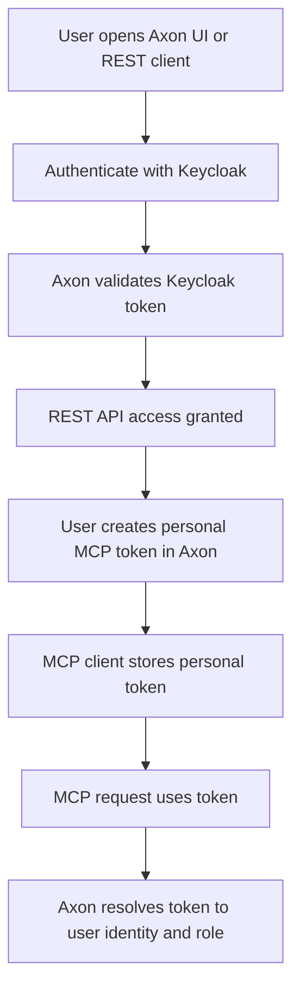
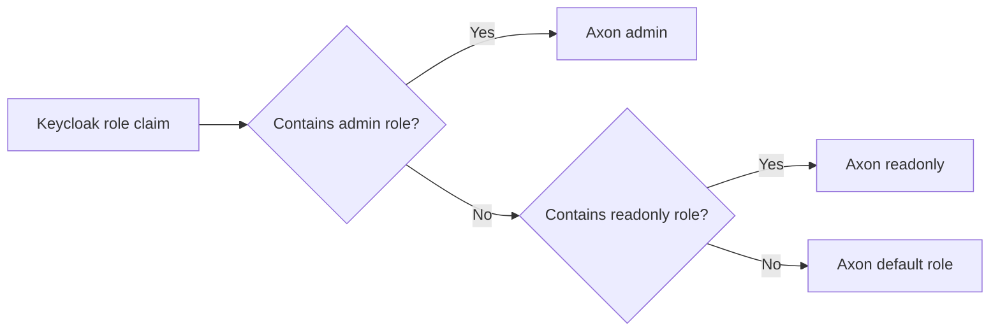
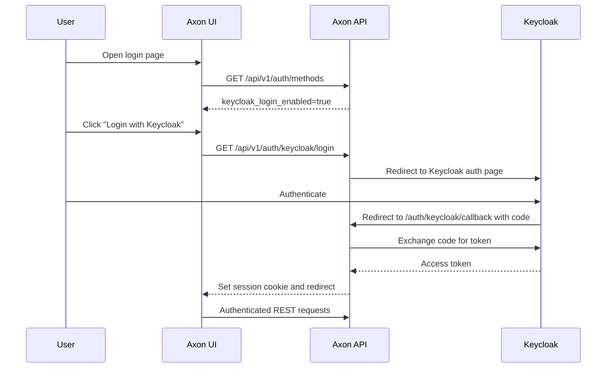
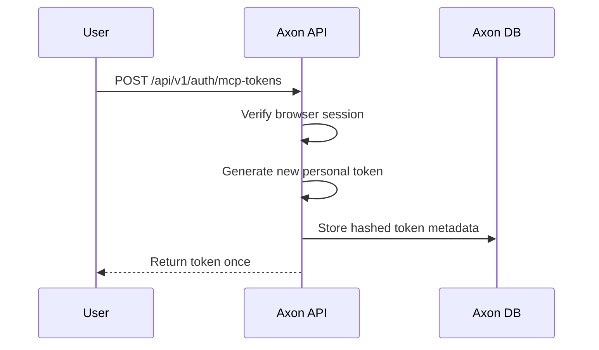
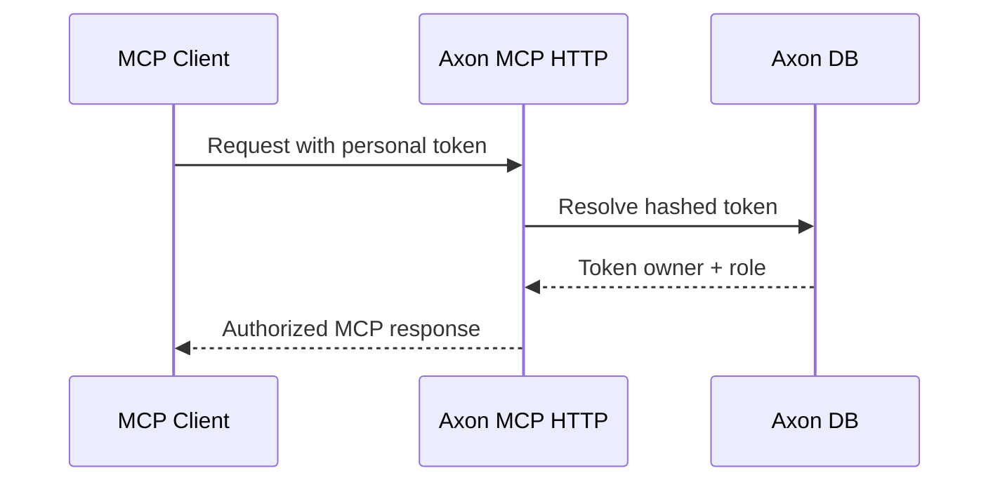

# Authentication Guide: Keycloak For REST, Personal Tokens For MCP

## Scope

This guide explains the chosen authentication model for Axon:

1. Keycloak is the primary identity provider for the REST API and browser login
2. users generate personal Axon tokens for MCP access after authenticating through REST

This is an operator and end-user guide, not an architecture proposal.

Related references:
- `docs/architecture/authentication_and_mcp_token_plan.md`
- `docs/reference/configuration.md`

## Model Summary



## Part 1: Admin Setup

### Goal

Set up Axon so that:

- browser and REST users authenticate through Keycloak
- authenticated users can generate personal MCP tokens
- MCP clients authenticate with those personal tokens

### What You Need

- a running Keycloak instance
- an Axon deployment reachable by browser users
- a stable external URL for the Axon API/UI

### Step 1: Create A Keycloak Realm And Client

In Keycloak:

1. create or choose the realm that will manage Axon users
2. create a client for Axon browser login
3. use OpenID Connect
4. set the client type according to your deployment:
   - confidential client if Axon will use a client secret
   - public client only if that matches your security model and redirect flow

Recommended client settings:

| Setting | Recommendation |
| --- | --- |
| Protocol | OpenID Connect |
| Standard Flow | Enabled |
| Direct Access Grants | Optional, not required for browser login |
| Valid Redirect URIs | Axon callback URL |
| Web Origins | Axon UI origin |

Typical callback URL:

```text
https://axon.example.com/api/v1/auth/keycloak/callback
```

If the UI is served from the same host, the web origin is typically:

```text
https://axon.example.com
```

### Step 2: Decide Role Mapping

Axon maps Keycloak claims into Axon roles.

Current model:

- admin users map to Axon `admin`
- read-only users map to Axon `readonly`
- anything unmatched falls back to `KEYCLOAK_DEFAULT_ROLE`

Recommended pattern:



### Step 3: Configure Axon

Set the auth methods so REST accepts Keycloak JWTs and MCP accepts personal tokens.

Minimum recommended settings:

```env
AUTH_ENABLED=true
REST_AUTH_METHODS=keycloak_jwt
MCP_AUTH_ENABLED=true
MCP_AUTH_METHODS=personal_token

KEYCLOAK_ISSUER_URL=https://keycloak.example.com/realms/axon
KEYCLOAK_CLIENT_ID=axon-ui
KEYCLOAK_CLIENT_SECRET=your_client_secret
KEYCLOAK_AUDIENCES='["axon-ui"]'
KEYCLOAK_SCOPES=openid,profile,email

KEYCLOAK_USERNAME_CLAIM=preferred_username
KEYCLOAK_ROLE_CLAIM=realm_access.roles
KEYCLOAK_ADMIN_ROLES='["admin"]'
KEYCLOAK_READ_ONLY_ROLES='["readonly"]'
KEYCLOAK_DEFAULT_ROLE=readonly
```

Notes:

- `KEYCLOAK_JWKS_URL` is optional if it can be derived from the issuer URL
- `KEYCLOAK_REDIRECT_URI` is optional; set it only when Axon must use a public callback URL different from the request URL
- you can keep `api_key` or `local_jwt` in the accepted method lists during migration if needed

### Step 4: Restart Axon Components

After updating configuration, restart the API service and any related runtime components that read auth settings at startup.

### Step 5: Verify Browser Login Availability

Check the auth-methods endpoint:

```bash
curl http://localhost:8080/api/v1/auth/methods
```

Expected result:

- `keycloak_login_enabled: true`

If local password login is disabled intentionally, `local_password_enabled` may be `false`.

### Step 6: Verify MCP Token Mode

Ensure MCP accepts personal tokens:

```env
MCP_AUTH_METHODS=personal_token
```

This is the cleanest final posture for the chosen model.

### Admin Checklist

| Check | Expected |
| --- | --- |
| Keycloak client exists | Yes |
| Redirect URI matches Axon callback | Yes |
| REST accepts `keycloak_jwt` | Yes |
| MCP accepts `personal_token` | Yes |
| Role claims map correctly | Yes |
| Browser login button appears | Yes |

## Part 2: User Authentication Flow

### Browser And REST Login

For the user, the normal login flow is:



What the user experiences:

1. open the Axon login page
2. choose `Login with Keycloak`
3. authenticate in Keycloak
4. return to Axon already signed in

The browser session is then used for normal REST/UI access.

### Creating A Personal MCP Token

After the user is signed in to Axon through Keycloak, they create a personal token through the REST API.

Conceptual flow:



Important behavior:

- the raw token is shown only at creation time
- Axon stores only a hash, not the raw token
- the token belongs to the authenticated user identity
- the token can later be listed and revoked

### Using The Token With MCP

The user then configures their MCP client with that personal token.

Runtime flow:



### End-To-End User Journey

1. sign in to Axon with Keycloak
2. create a personal MCP token
3. copy the token into the MCP client configuration
4. use the MCP client normally
5. revoke and replace the token if it is lost or rotated

## Recommended Production Posture

For the chosen path, the simplest recommended posture is:

| Surface | Recommended auth |
| --- | --- |
| Browser/UI | Keycloak |
| REST API | Keycloak |
| MCP HTTP | Personal Axon token |

Optional migration/fallback methods such as shared API keys or local JWT can remain enabled temporarily, but they are not the target steady state for this guide.

## Current Limits

This guide reflects the current implementation and the current deferrals.

Not covered yet:

1. rich local user profiles beyond claim-derived identity
2. audit trails for logins and token use
3. personal-space or local-change tracking features
4. OAuth-native MCP client login instead of personal tokens

## Troubleshooting

| Symptom | Likely cause | What to check |
| --- | --- | --- |
| Keycloak login button does not appear | Keycloak browser login is not fully configured | `REST_AUTH_METHODS`, `KEYCLOAK_ISSUER_URL`, `KEYCLOAK_CLIENT_ID` |
| Keycloak redirects but login fails on callback | redirect URI mismatch or client config issue | Keycloak client redirect URI and Axon callback URL |
| User can log into UI but cannot create MCP token | REST auth works but token endpoint auth/role is wrong | accepted REST auth methods and role mapping |
| MCP token does not work | MCP auth methods do not include personal tokens | `MCP_AUTH_METHODS=personal_token` |
| Wrong Axon role after login | claim mapping mismatch | `KEYCLOAK_ROLE_CLAIM`, admin/readonly role lists |
